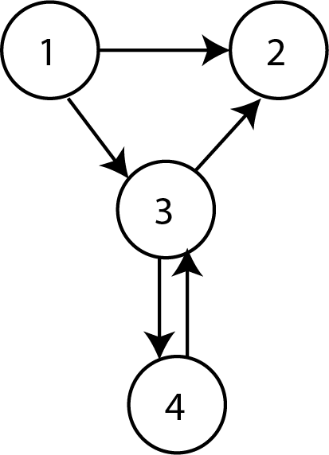
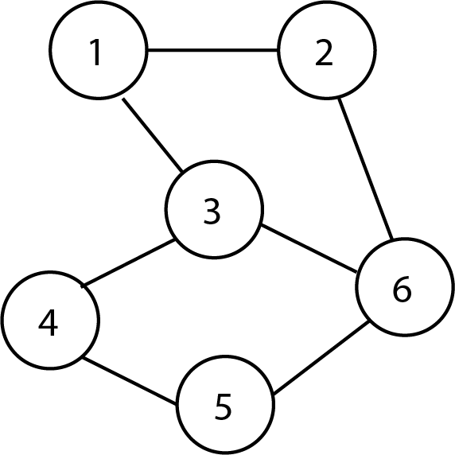
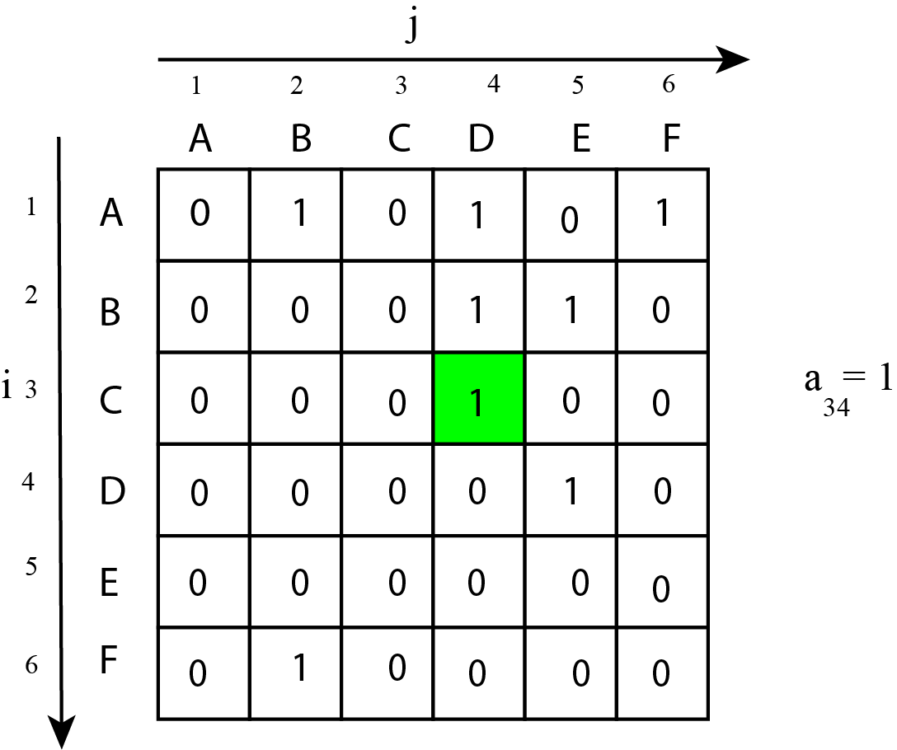

# Les structures de données relationnelles

## 1) Les graphes

Un graphe est une structure de données constituée d'objets appelés sommets et de relations entre ces sommets. Il existe deux types de graphes: 

- les graphes **orientés** : les relations sont appelées **arcs**

Terminologie : on note  x➔y l'arc (x,y) où x est son extrémité initiale et y son extrémité finale. y est le successeur de x et x est le prédécesseur de y. Deux arcs d'un graphe sont **adjacents** s'ils possèdent au moins une extrémité commune. Deux sommets d'un graphe orienté sont dits **adjacents** s'il existe un arc les joignant. Le degré d'un sommet x est le nombre d'arcs dont x est une extrémité. On appelle **chemin** toute suite de sommets consécutifs reliés par des arcs. Un chemin est dit **élémentaire** s'il ne comporte pas plusieurs fois le même sommet. Un chemin dont le sommet de début est le même que celui de fin est appelé **circuit**. Un graphe orienté est dit **fortement convexe** lorque pour toute paire de sommets distincts (u,v), il existe un chemin de u vers v et un chemin de v vers u.

- les graphes **non-orientés** : les relations sont appelées **arêtes**

Terminologie : On appelle x-y l'arête (x,y) dans un graphe non-orienté où x et y sont les deux extrémités.
Deux arêtes d'un graphe sont dites adjacentes si elles possèdent au moins une extrémité commune. Deux sommets d'un graphe non-orienté sont dits **adjacents** s'il existe une arête les joignant. On appelle **degré du sommet** x le nombre d'arêtes dont x est une extrémité. On appelle **chaîne** toute suite de sommets consécutifs reliés par des arêtes. Une chaîne est dite élémentaire si elle ne comporte pas plusieurs fois le même sommet. Une chaîne dont le sommet de début est le même que le sommet de fin est appelé **cycle**. Le graphe est dit **connexe** lorsqu'il existe une chaîne pour toute paire de sommets ; en d'autres termes, le graphe comporte un seul morceau. Un graphe non-orienté non convexe se décompose en composantes connexes. Un graphe non-orienté est dit **complet** si chacun des sommets est relié directement à tous les autres.

## 2) Matrice et liste d'adjacence associées à un graphe

On appelle **matrice d'adjacence** d'un graphe non étiqueté à n sommets S1, S2... Sn la matrice carrée (tableau à n lignes et n colonnes) constituée des coefficients aij (à l'intersection de la ième ligne et de la jième colonne) tels que : 
aij=k s'il existe k relations entre Si et Sj ; 0 autrement.

Après avoir ordonné les sommets dans l'ordre alphabétique :

On peut également représenter un graphe orienté en donnant pour chacun des sommets la liste des sommets que l'on peut atteindre directement par un arc, cela constitue la **liste des successeurs**. On peut également donner la liste des sommets d'où il est accessible directement, cela constitue la **liste des prédécesseurs**.

<table>
<tr>
<td>
Sommet
</td>
<td>
Liste des successeurs
</td>
<td>
Liste des prédécesseurs
</td>
</tr>
<tr>
<td>
A
</td>
<td>
(B,D,F)
</td>
<td>
∅
</td>
</tr>
<tr>
<td>
B
</td>
<td>
(D,E)
</td>
<td>
(A,F)
</td>
</tr>
<tr>
<td>
C
</td>
<td>
(D)
</td>
<td>
∅
</td>
</tr>
<tr>
<td>
D
</td>
<td>
(E)
</td>
<td>
(A,B,C)
</td>
</tr>
<tr>
<td>
E
</td>
<td>
∅
</td>
<td>
(B,D)
</td>
</tr>
<tr>
<td>
F
</td>
<td>
(B)
</td>
<td>
(A)
</td>
</tr>
</table>
Dans le cas d'un graphe non-orienté, on ne parle pas de prédécesseurs ou de successeurs mais plutôt de voisins.

## 3)Le type abstrait graphe orienté

Opérations :

- CREER_GRAPHE_VIDE() : retourne un objet de type graphe
- AJOUTER_SOMME_GRAPHE(G,s) : le sommet s est ajouté au graphe G
- AJOUTER_ARC(G,sd,sa) : l'arc est créé et orienté entre les sommets de départ sd et d'arrivée sa.
- SUPPRIMER_SOMMET(G,s) : le sommet s est supprimé du graphe G
- SUPPRIMER_ARC(G,sd,sa) : l'arc orienté du sommet de départ sd vers le sommet d'arrivée sa est supprimé
- SOMMET_EXISTE(G,s) : retourne True si le sommet s est présent dans le graphe G et False sinon.
- ARC_EXISTE(G,sd,sa) : retourne True si l'arc orienté de sd vers sa est présent dans le graphe G, False sinon.

Exemple d'application :

G=CREER_GRAPHE_VIDE()
AJOUTER_SOMMET(G,1)
AJOUTER_SOMMET(G,2)
AJOUTER_SOMMET(G,3)
AJOUTER_SOMMET(G,4)
AJOUTER_SOMMET(G,5)
AJOUTER_SOMMET(G,6)
AJOUTER_ARC(G,1,2)
AJOUTER_ARC(G,2,4)
AJOUTER_ARC(G,5,2)
AJOUTER_ARC(G,4,5)
AJOUTER_ARC(G,1,3)
AJOUTER_ARC(G,3,5)
AJOUTER_ARC(G,4,6)

