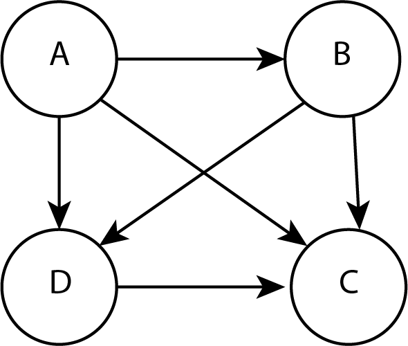
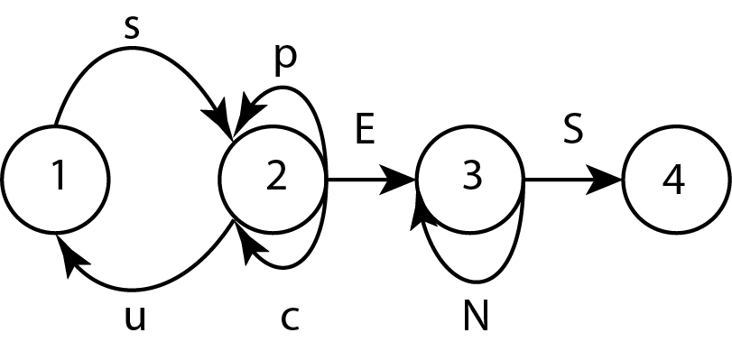

## Exercices structures de données relationnelles

**Exercice 1** :  

On souhaite organiser un tournoi de footall avec 4 équipes numérotées de 1 à 4. Chaque équipe rencontre une seule fois toutes les autres.

1. Représenter la situation sous la forme d'un graphe.
2. Combien d'arêtes possède-t-il ? En déduire le nombre de matchs au total pour ce tournoi ?
3. Ce graphe est-il connexe ?
4. Ce graphe est-il complet ?

**Exercice 2** :  

Un club de tennis doit selectionner deux joueurs parmi quatre pour représenter le club à un tournoi national. Les quatre joueurs sont notés A, B, C, et D. Pour réaliser la sélection, le club organise des matchs : chaque joueur rencontre les trois autres.
Règles : 
- tout match gagné donne un point
- tout match perdu enlève un point
Les joueurs sélectionnés sont les joueurs ayant obtenu le plus grand nombre de points. On donne le résultat sous la forme d'un graphe orienté.

Le sens de l'arc A➔B indique que A a battu B.

1. Donner le nombre de points de chaque joueur.
2. En déduire les joueurs sélectionnés.

**Exercice 3** :

Pour accéder à sa messagerie, Antoine a choisi un code qui être reconnu par le graphe étiqueté suivant les sommets 1-2-3-4. Une succession de lettres constitue un code possible si ces lettres se succèdent sur un chemin du graphe orienté ci-dessous en partant du sommet 1 et en sortant au sommet 4.

 

1. Parmi les trois codes suivants, quel(s) est(sont) le(les) code(s) reconnu(s) par le graphe : SUCCES, SCENES, SUSPENS ?
2. Quelle est la taille du plus petit code possible ? Ce code est-il unique ?
3. Y-a-t-il une taille maximale ?

**Exercice 4** : 

On considère un groupe de 10 personnes présentes sur un réseau social, le tableau suivant indique les paires de personnes qui ont une relation d'amitié dans ce réseau social.

<table>
<tr>
<td>i
</td>
<td>Amis de i
</td>
</tr>
<tr>
<td>1
</td>
<td>3,6,7
</td>
</tr>
<tr>
<td>2
</td>
<td>6,8
</td>
</tr>
<tr>
<td>3
</td>
<td>1,6,7
</td>
</tr>
<tr>
<td>4
</td>
<td>5,10
</td>
</tr>
<tr>
<td>5
</td>
<td>4,10
</td>
</tr>
<tr>
<td>6
</td>
<td>1,2,3,7
</td>
</tr>
<tr>
<td>7
</td>
<td>1,3,6
</td>
</tr>
<tr>
<td>8
</td>
<td>2
</td>
</tr>
<tr>
<td>9
</td>
<td>
</td>
</tr>
<tr>
<td>10
</td>
<td>4,5
</td>
</tr>
</table>

1. Représenter cette situation par un graphe dans lequel une arête montre le lien d'amitié.
2. Ce graphe est-il connexe ? Si non, donner ses composantes connexes.
3. L'adage "Les amis de nos amis sont nos amis" est-il vérifié ? Si non, que faudrait-il faire pour qu'il le soit ?

