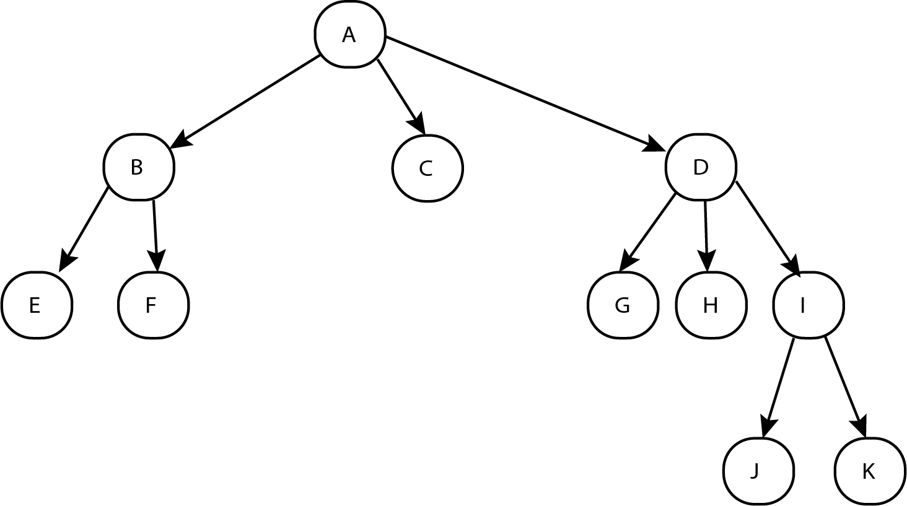
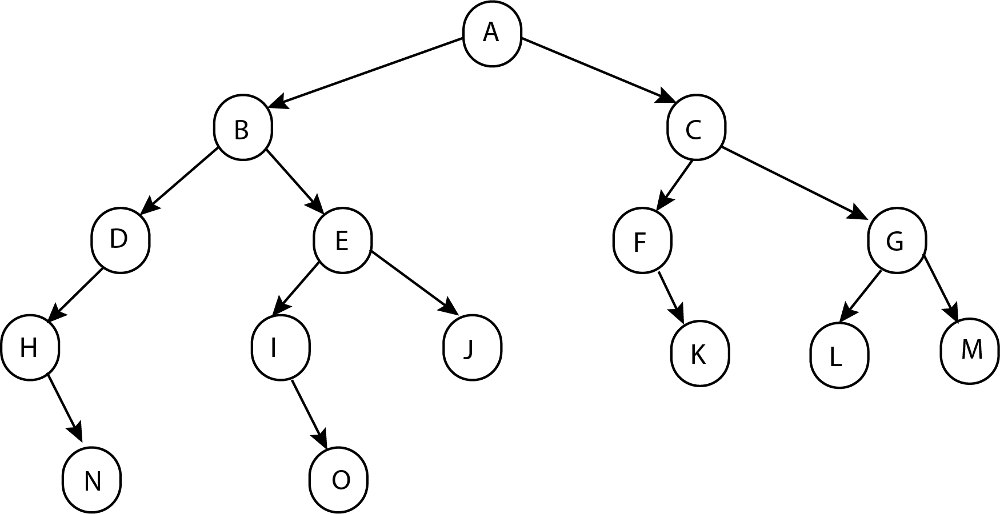
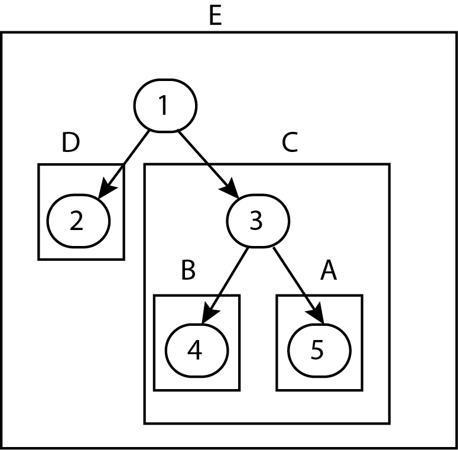

# Les structures de données hiérarchiques

## 1) Les arbres

Un arbre est une structure de données constituée de **noeuds**, lesquels peuvent avoir des enfants qui deviennnent d'autres noeuds.
Il s'agit d'une structure hiérarchisée dont le sommet est appelé la **racine**.
Un noeud qui ne possède pas d'enfant est appelé **feuille**.
Les noeuds autres que la racine et les feuilles sont appelés des **noeuds internes**.
Une **branche** est une suite finie de noeuds de la racine vers une feuille ; un arbre a donc autant de branches que de feuille.

Exemple : l'arbre ci-dessous possède 11 noeuds dont :

- 1 racine : le noeud A
- 3 noeuds internes B, D et I
- 7 feuilles et donc 7 branches

Un arbre peut être caractérisé par :
- son **arité** : le nombre maximal d'enfant qu'un noeud peut avoir
- sa **taille** : le nombre de noeuds qui le composent (racine comprise)
- sa **hauteur** : la profondeur, en nombre de niveaux parcourus, à laquelle il faut descendre pour trouver la feuille la plus éloignée de la racine (hiérarchie la plus basse)

Sur l'exemple de l'arbre précédent, son arité est de 3, sa taille est de 11, sa hauteur est de 3.

## 2) Les arbres binaires

Un arbre binaire est un arbre d'arité égale à 2 ; les noeuds peuvent en effet avoir 0, 1 ou 2 enfants au maximum.
Pour un arbre binaire, on définit à partir d'un noeud : le sous-arbre de gauche SAG et le sous-arbre de droite SAD.
Un arbre binaire **dégénéré** ou filiforme est un arbre dont les noeuds ne possèdent qu'un seul ou aucun enfant.
Un arbre binaire **localement complet** est un arbre dont chacun des noeuds possèdent deux ou aucun enfant.
Un arbre binaire **complet** est un arbre localement complet dont toutes les feuilles sont au même niveau.

## 3) Mesures sur les arbres binaires

Sur ces arbres, nous pouvons établir quelques opérations qui vont nous permettre de prendre des mesures et de pouvoir déterminer la complexité des différents algorithmes qui leur seront appliqués.
Ces opérations sont les suivantes : 
- La **taille** d'un arbre B notée T(B) correspond au nombre de ses noeuds, elle est définie par : T(B)=0 si l'arbre est vide ; T(B)=1+T(SAG)+T(SAD).
- La **hauteur d'un noeud** x d'un arbre notée H(x) est définie par :
H(x)=0 si x est la racine de l'arbre ; H(x)=1+H(y) si y est le père de x.
- La **hauteur d'un arbre** B notée H(B) est définie par H(B)=Max((H(x)) avec x les noeuds de B. La hauteur est aussi désignée **profondeur** de l'arbre, elle est égale au nombre d'**arêtes** entre la racine et la feuiile la plus éloignée.
- La **longueur de cheminement d'un arbre** B notée LC(B) est la somme, pour tous les noeuds de l'arbre, de la hauteur de ses noeuds.
- La **longueur de cheminement externe** d'un arbre B notée LCE(B) est la somme pour toutes les feuilles de l'arbre de leur hauteur.
- La **longueur de cheminement interne** d'un arbre B notée LCI(E) est la différence LC(B)-LCE(B).
- La **profondeur moyenne d'un arbre** B notée PM(B) est définie par : PM(B)=LC(B)/T(B).
- La **profondeur moyenne externe** d'un arbre B possédant un nombre NF de feuilles est définie par : PME(B)=LCE(B)/NF.
- La **profonfeur moyenne interne** d'un arbre B possédant un nombre NF de feuilles est définie par : PMI(B)=LCI(B)/(T(B)-NF).
Ces mesures seront utiles pour déterminer la complexité des algorithmes appliqués aux arbres.

Mettons en pratique ces opérations sur l'arbre binaire suivant appelé α.

Donnons d'abord quelques caractéristiques de l'arbre α :

- Le noeud A est la racine de l'arbre.
- Le sous arbre de gauche est l'arbre de racine B.
- Le sous arbre de droite est l'arbre de racine C.
- L'arbre possède 6 feuilles : N, O, J, K, L, M ainsi NF=6.
- L'arbre possède autant de branches que de feuilles donc 6 branches : ABDHN, ABEIO, ABEJ, ACFK, ACGL, ACGM.

Évaluons maintenant les mesures:

- Taille de l'arbre : T(α)=nombre de noeuds = 15
- Hauteurs des noeuds :
H(A)=0 ; H(B)=H(C)=1 ; H(D)=H(E)=H(F)=H(G)=2 ; H(H)=H(I)=H(J)=H(K)=H(L)=H(M)=3 ; H(N)=H(O)=4
- Hauteur ou profondeur de l'arbre : 4
- Longueur de cheminement de l'arbre : LC(α)=H(A)+H(B)+....H(O)=2*1+4*2+6*3+2*4=36
- Longueur de cheminement externe de l'arbre : LCE(α)=H(N)+H(O)+H(J)+H(K)+H(L)+H(M)=4+4+3+3+3+3=20
- Longueur de cheminement interne de l'arbre : LCI(α)=LC(α)-LCE(α)=36-20=16
- Profondeur moyenne de l'arbre : PM(α)=LC(α)/T(α)=36/15=2.4
- Profondeur moyenne externe de l'arbre : PME(α)=LCE(α)/NF=20/6=3.33
- Profondeur moyenne interne de l'arbre : PMI(α)=LCI(α)/(T(α)-NF)=16/(15-6)=16/9=1.78

## 4) Type abstrait Arbre

De façon analogue aux structures abstraites séquentielles, on peut proposer une structure abstraite Arbre qui pourra être implanté de différentes façons.

Opérations :
- CREER_ARBRE_VIDE() : retourne un objet de type arbre
- CREER_ARBRE(e,Ag,Ad) : la racine de cet arbre est définie par l'élément e, le SAG est défini par l'arbre Ag, le SAD est défini par l'arbre Ad.
- CREER_ARBRE_FEUILLE(e) : la racine de cet arbre est définie par l'élément e, le SAG et le SAD sont deux arbres vides.
- RACINE(A) : renvoie la racine de l'arbre A
- SAG(A) : renvoie le sous-arbre gauche de l'arbre A
- SAD(A) : renvoie le sous-arbre droit de l'arbre A
- EST_VIDE(A) : retourne TRUE si l'arbre est vide, FALSE sinon.

Exemple d'application :

A=CREER_ARBRE_FEUILLE(5).   
B=CREER_ARBRE_FEUILLE(4).   
C=CREER_ARBRE(3,B,A).   
D=CREER_ARBRE_FEUILLE(2).   
E=CREER_ARBRE(1,D,C).   

  

