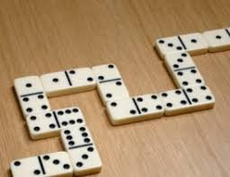
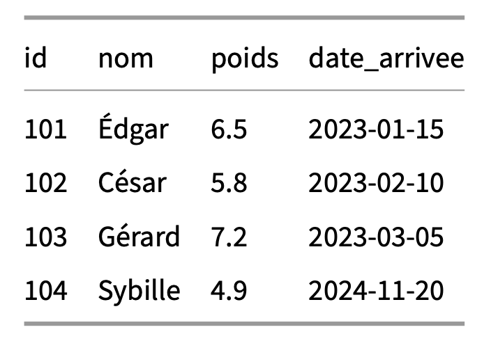

## Exercices programmation orienté objet

**Exercice 1** :  

On souhaite caractériser la notion de point telle qu'elle existe en deux dimensions : aussi bien en coordonnées cartésiennes qu'en coordonnées polaires.
Une version simplifiée est la suivante.

```python
import math
x=float(input("abscisse : "))
y=float(input("ordonnée : "))
if (x>0):
    θ=math.atan(y/x)
if (x<0) and (y>=0):
    θ=math.atan(y/x)+math.pi
if (x<0) and (y<0):
    θ=math.atan(y/x)-math.pi
if (x==0) and (y>0):
    θ=math.pi/2
if (x==0) and (y<0):
    θ=-math.pi/2
if (x==0) and (y==0):
    θ=0
θ=180*θ/math.pi
r=math.sqrt(x**2+y**2)
print("le rayon r vaut :",r," et l'angle θ(degré) vaut : ",θ)
```
Réaliser une classe Point pour pouvoir obtenir ceci dans la console :

```python
>>> A=Point(-2,5)
>>> A.convertis()
le rayon r vaut : 5.385164807134504  et l'angle θ(degré) vaut :  111.80140948635182
>>> B=Point(5,5)
>>> B.convertis()
le rayon r vaut : 7.0710678118654755  et l'angle θ(degré) vaut :  45.0
```

On créera deux méthodes privées `get_θ` et `get_r` et une méthode publique `convertis`.

**Exercice 2** : 

Le domino est un jeu très ancien composé de 28 pièces toutes différentes. Sur chacune de ces pièces, il y a deux côtés constitués de 0 (blanc) à 6 points. Lorsque deux côtés possèdent le même nombre de points, on l'appelle domino double.

On commence par mélanger tous les dominos, face cachée au milieu de la table et chaque joueur prend ses dominos de départ qu’il place devant lui en prenant soin de les  cacher aux autres joueurs.

Les dominos restants composent la pioche (ou le talon) placée à un endroit accessible à tous.

À 2 joueurs chacun prend 7 dominos.

<p align="center"></p>


1. Proposer une classe Domino permettant de représenter une pièce. Les objets seront initialisés par les valeurs portées par les deux côtés (gauche et droite). On définit des méthodes `est_double` et `est_blanc` pour tester si le domino est double ou blanc. On ajoutera également une méthode `affiche` qui affiche les valeurs des deux faces de manière horizontale pour un domino classique et de manière verticale pour un domino double.

2. Proposer une classe JeuDeDomino permettant de manipuler le jeu de domino complet. On créera une méthode pour créer les dominos (les mettre dans `jeu`), pour les `mélanger`, puis pour les `distribuer` en les affichant. 

Indication : on utilisera la méthode random.shuffle(mylist)
   
```python
>>> import random

mylist = ["apple", "banana", "cherry"]
random.shuffle(mylist)
>>> mylist
['banana', 'apple', 'cherry']
```
   

3. On créera également une méthode `couples_de_dominos` pour réaliser des couples de dominos, puis une méthode `affichage_de_dominos_couples` pour afficher ces couples.


```python
>>> jeu = JeuDeDomino()
>>> jeu.creer()
>>> jeu.distribuer()
Joueur 1
 __________
|          |
|    0     |
|__________|
|    0     |
|__________|
 _______________
|              | 
|   1   |   0  |
|              |
‾‾‾‾‾‾‾‾‾‾‾‾‾‾‾
 __________
|          |
|    1     |
|__________|
|    1     |
|__________|
 _______________
|              | 
|   2   |   0  |
|              |
‾‾‾‾‾‾‾‾‾‾‾‾‾‾‾
 _______________
|              | 
|   2   |   1  |
|              |
‾‾‾‾‾‾‾‾‾‾‾‾‾‾‾
 __________
|          |
|    2     |
|__________|
|    2     |
|__________|
 _______________
|              | 
|   3   |   0  |
|              |
‾‾‾‾‾‾‾‾‾‾‾‾‾‾‾
_________________
Joueur 2
 _______________
|              | 
|   3   |   1  |
|              |
‾‾‾‾‾‾‾‾‾‾‾‾‾‾‾
 _______________
|              | 
|   3   |   2  |
|              |
‾‾‾‾‾‾‾‾‾‾‾‾‾‾‾
 __________
|          |
|    3     |
|__________|
|    3     |
|__________|
 _______________
|              | 
|   4   |   0  |
|              |
‾‾‾‾‾‾‾‾‾‾‾‾‾‾‾
 _______________
|              | 
|   4   |   1  |
|              |
‾‾‾‾‾‾‾‾‾‾‾‾‾‾‾
 _______________
|              | 
|   4   |   2  |
|              |
‾‾‾‾‾‾‾‾‾‾‾‾‾‾‾
 _______________
|              | 
|   4   |   3  |
|              |
‾‾‾‾‾‾‾‾‾‾‾‾‾‾‾
>>> jeu.affichage_de_dominos_couples()
 _______________
|              | 
|   4   |   0  |
|              |
‾‾‾‾‾‾‾‾‾‾‾‾‾‾‾
 __________
|          |
|    0     |
|__________|
|    0     |
|__________|
********************************
 _______________
|              | 
|   3   |   1  |
|              |
‾‾‾‾‾‾‾‾‾‾‾‾‾‾‾
 _______________
|              | 
|   1   |   0  |
|              |
‾‾‾‾‾‾‾‾‾‾‾‾‾‾‾
********************************
 _______________
|              | 
|   4   |   1  |
|              |
‾‾‾‾‾‾‾‾‾‾‾‾‾‾‾
 _______________
|              | 
|   1   |   0  |
|              |
‾‾‾‾‾‾‾‾‾‾‾‾‾‾‾
********************************
 _______________
|              | 
|   3   |   1  |
|              |
‾‾‾‾‾‾‾‾‾‾‾‾‾‾‾
 __________
|          |
|    1     |
|__________|
|    1     |
|__________|
********************************
 _______________
|              | 
|   4   |   1  |
|              |
‾‾‾‾‾‾‾‾‾‾‾‾‾‾‾
 __________
|          |
|    1     |
|__________|
|    1     |
|__________|
********************************
 _______________
|              | 
|   3   |   2  |
|              |
‾‾‾‾‾‾‾‾‾‾‾‾‾‾‾
 _______________
|              | 
|   2   |   0  |
|              |
‾‾‾‾‾‾‾‾‾‾‾‾‾‾‾
********************************
 _______________
|              | 
|   4   |   2  |
|              |
‾‾‾‾‾‾‾‾‾‾‾‾‾‾‾
 _______________
|              | 
|   2   |   0  |
|              |
‾‾‾‾‾‾‾‾‾‾‾‾‾‾‾
********************************
 _______________
|              | 
|   3   |   2  |
|              |
‾‾‾‾‾‾‾‾‾‾‾‾‾‾‾
 _______________
|              | 
|   2   |   1  |
|              |
‾‾‾‾‾‾‾‾‾‾‾‾‾‾‾
********************************
 _______________
|              | 
|   4   |   2  |
|              |
‾‾‾‾‾‾‾‾‾‾‾‾‾‾‾
 _______________
|              | 
|   2   |   1  |
|              |
‾‾‾‾‾‾‾‾‾‾‾‾‾‾‾
********************************
 _______________
|              | 
|   3   |   2  |
|              |
‾‾‾‾‾‾‾‾‾‾‾‾‾‾‾
 __________
|          |
|    2     |
|__________|
|    2     |
|__________|
********************************
 _______________
|              | 
|   4   |   2  |
|              |
‾‾‾‾‾‾‾‾‾‾‾‾‾‾‾
 __________
|          |
|    2     |
|__________|
|    2     |
|__________|
********************************
 __________
|          |
|    3     |
|__________|
|    3     |
|__________|
 _______________
|              | 
|   3   |   0  |
|              |
‾‾‾‾‾‾‾‾‾‾‾‾‾‾‾
********************************
 _______________
|              | 
|   4   |   3  |
|              |
‾‾‾‾‾‾‾‾‾‾‾‾‾‾‾
 _______________
|              | 
|   3   |   0  |
|              |
‾‾‾‾‾‾‾‾‾‾‾‾‾‾‾
********************************```

Indication :
Pour obtenir les 28 pièces, sans répétition du symétrique, car ainsi pour un i donné, on forme tous les couples (i,j) possibles :

```python
jeu=[]
for i in range(7):
    for j in range(i+1):
        jeu.append((i,j))
print(jeu)
>>> %Run Domino.py
[(0, 0), (1, 0), (1, 1), (2, 0), (2, 1), (2, 2), (3, 0), (3, 1), (3, 2), (3, 3), (4, 0), (4, 1), (4, 2), (4, 3), (4, 4), (5, 0), (5, 1), (5, 2), (5, 3), (5, 4), (5, 5), (6, 0), (6, 1), (6, 2), (6, 3), (6, 4), (6, 5), (6, 6)]

```

```python
import random

class Domino:
    def __init__(self, gauche, droite):
        self.gauche = gauche
        self.droite = droite

    def est_double(self):
        """
        Vérifie si le domino est un double.

        >>> Domino(3, 3).est_double()
        True
        >>> Domino(2, 5).est_double()
        False
        """
        pass

    def est_blanc(self):
        """
        Vérifie si le domino est un double blanc.

        >>> Domino(0, 0).est_blanc()
        True
        >>> Domino(0, 3).est_blanc()
        False
        """
        pass

    def affiche(self):
        """
        Affiche un domino double verticalement sinon horizontalement
        >>> domino=Domino(4,4)
        >>> domino.affiche()
         __________
        |          |
        |    4     |
        |__________|
        |    4     |
        |__________|
        >>> domino=Domino(3,4)
        >>> domino.affiche()
         _______________
        |              | 
        |   3   |   4  |
        |              |
        ‾‾‾‾‾‾‾‾‾‾‾‾‾‾‾
        """
        if self.gauche != self.droite:
            print(" _______________")
            print("|              | ")
            print(f"|   {self.gauche}   |   {self.droite}  |")
            print("|              |")
            print("‾‾‾‾‾‾‾‾‾‾‾‾‾‾‾")
        else:
            print(" __________")
            print("|          |")
            print(f"|    {self.gauche}     |")
            print("|__________|")
            print(f"|    {self.gauche}     |")
            print("|__________|")


class JeuDeDomino:
    def __init__(self):
        self.jeu = []
        self.joueur1 = []
        self.joueur2 = []

    def creer(self):
		pass

    def melanger(self):
		pass

    def distribuer(self):
		pass
            
    
    def couples_de_dominos(self):
        """
        Renvoie la liste des couples compatibles entre joueur1 et joueur2.
        
        >>> j = JeuDeDomino()
        >>> j.joueur1 = [Domino(1, 2), Domino(5, 3)]
        >>> j.joueur2 = [Domino(3, 1), Domino(2, 4), Domino(5, 1)]
        >>> [(d1.gauche, d1.droite, d2.gauche, d2.droite) for d1, d2 in j.couples_de_dominos()]
        [(3, 1, 1, 2), (1, 2, 2, 4), (5, 1, 1, 2), (5, 3, 3, 1), (5, 1, 5, 3)]
        """
		pass
    
    
    def affichage_de_dominos_couples(self):
		pass
                
                
if __name__ == '__main__':
    import doctest
    doctest.testmod(verbose=True)

```

**Exercice 3 : Inspiré d'un sujet de bac pratique 2026**

Les cartes mémoire (ou flashcards) sont des supports de révision comportant au recto une question
et au verso la réponse. Elles permettent des révisions actives très efficaces.
On souhaite développer une application utilisant le système des boîtes de Leitner, qui permet de
gérer ces cartes en se basant sur un principe de répétition espacée.
Dans cette méthode, chaque carte possède un niveau d’avancement (de 0 à 4). Plus le niveau est
élevé, plus le délai avant la prochaine révision est grand. Les délais sont donnés par le tableau
suivant :

Niveau de la carte et délai avant révision

0 : 1 jour

1 : 3 jours

2 : 7 jours

3 : 15 jours

4 : 30 jours


En pratique, la méthode fonctionne ainsi : lorsque l’utilisateur révise une carte, s’il répond correctement, la carte passe au niveau supérieur (sans dépasser le niveau 4 maximum).

S’il se trompe, la carte retombe immédiatement au niveau 0, quel que soit son niveau précédent. La prochaine date de révision est ensuite calculée en ajoutant le délai du nouveau niveau à la date du jour.
On modélise ce fonctionnement à l’aide de la Programmation Orientée Objet.

1) Écrire la méthode `traiter_reponse(self, succes)` qui prend en paramètre un
booléen succes (True si l’utilisateur a bien répondu, False sinon). Cette méthode
doit mettre à jour l’attribut `self.niveau` de la carte selon les règles de Leitner énoncées accessible dans la liste globale DELAIS, puis calculer et mettre à jour l’attribut
self.date_prochaine.

Indication : Pour ajouter des jours à la date d’aujourd’hui, on utilisera la fonction fournie
date_future(nb_jours) qui renvoie la date située nb_jours après aujourd’hui.

2) On considère que la base de révision, le paquet de cartes, est une liste d’instances de la classe Carte.

Écrire une fonction `extraire_cartes_du_jour(paquet, date_jour)` qui prend en paramètres une liste de cartes paquet et une date de référence date_jour et qui renvoie une nouvelle liste contenant uniquement les cartes dont la date_prochaine est inférieure ou égale à date_jour.
On admet qu’on peut comparer des dates avec les opérateurs usuels <, <=, ==, >= et >.

3) Afin d’aider l’étudiant à cibler ses lacunes, on souhaite extraire du paquet les cartes qui lui posent le plus de problèmes, c’est-à-dire celles dont le niveau est le plus bas parmi toutes les cartes du paquet.

La fonction `extraire_cartes_a_renforcer(paquet)` a été rédigée dans ce but. Cependant, elle contient une faille logique.

Exécuter la fonction test_renforcement() fournie. Observer le résultat affiché dans la console et constater l’incohérence.

Analyser le code de la fonction `extraire_cartes_a_renforcer(paquet)`, identifier la source de cette erreur logique, puis corriger le code afin qu’il ne renvoie que les cartes possédant rigoureusement le niveau minimum.

```python
import datetime

def date_future(nb_jours):
    """Renvoie la date située nb_jours après aujourd'hui"""
    return datetime.date.today() + datetime.timedelta(days=nb_jours)

# Variable contenant les délais en jours pour chaque niveau (index 0 à 4)
DELAIS = [1, 3, 7, 15, 30]

class Carte:

    def __init__(self, question, reponse):
        self.question = question
        self.reponse = reponse
        self.niveau = 0
        # À la création, la carte est à réviser le jour même
        self.date_prochaine = datetime.date.today()

    def __repr__(self):
        return f"<Carte: {self.question} (Niveau {self.niveau})>"

    #############################################################################
    # Écrire la méthode traiter_reponse(self, succes) de la question 1          #
    #############################################################################

# Des cartes et un paquet de cartes pour réaliser des tests
c1 = Carte("Capitale de l'Italie ?", "Rome")
c1.niveau = 2
c1.date_prochaine = date_future(4)
c2 = Carte("7 x 8 ?", "56")
c2.date_prochaine = date_future(1)
c3 = Carte("Symbole du Fer ?", "Fe")
c3.date_prochaine = date_future(7)

paquet = [c1, c2, c3]
   

#############################################################################
# Écrire la fonction extraire_cartes_du_jour de la question 2               #
#############################################################################


#############################################################################
# Fonction défaillante à analyser et corriger pour la question 3            #
#############################################################################

def extraire_cartes_a_renforcer(paquet):
    """
    Parcourt le paquet et renvoie la liste des cartes ayant le 
    niveau d'avancement le plus faible.
    """
    if len(paquet) == 0:
        return []
        
    niveau_min = paquet[0].niveau
    a_renforcer = []
    
    for carte in paquet:
        if carte.niveau < niveau_min:
            niveau_min = carte.niveau
            a_renforcer.append(carte)
        elif carte.niveau == niveau_min:
            a_renforcer.append(carte)
            
    return a_renforcer


def test_renforcement():
    # Création d'un paquet de test
    c1 = Carte("Capitale de l'Italie ?", "Rome")
    c1.niveau = 2
    
    c2 = Carte("7 x 8 ?", "56")
    c2.niveau = 1
    
    c3 = Carte("Symbole du Fer ?", "Fe")
    c3.niveau = 2
    
    mon_paquet = [c1, c2, c3]
    
    # Appel de la fonction défaillante
    resultat = extraire_cartes_a_renforcer(mon_paquet)
    
    print("Cartes à renforcer (niveau le plus bas attendu : 1) :")
    print(resultat)
```

**Exercice 4 : Inspiré d'un sujet de bac pratique 2026**

Le renard, longtemps considéré comme nuisible, est aujourd’hui de plus en plus protégé pour
son rôle dans la régulation de la biodiversité. Afin d’aider à la réhabilitation des individus blessés ou orphelins, un refuge de protection a été construit. La personne en charge de l’infrastructure souhaite réaliser une base de données en CSV et Python pour stocker les informations essentielles sur les renards pris en charge.

Deux entités distinctes sont représentées.

La première entité est le Renard. Un renard est défini par un identifiant de type entier, un nom sous forme de chaîne de caractères, un poids en kilogrammes de type flottant, ainsi qu’une date d’arrivée représentée par une chaîne de caractères au format AAAA-MM-JJ.

La seconde entité est le Refuge. Un refuge est défini par son nom, son adresse postale, et une liste regroupant les objets de type Renard qu’il héberge.

Toutes les données relatives aux animaux sont fournies dans le fichier [donnees_renards.csv](Assets/donnees_renards.csv), structuré au format CSV avec le point-virgule comme séparateur, placé dans le dossier Assets.

Extrait d’informations fournies dans le fichier donnees_renards.csv :
<p align="center"></p>

1) Écrire le code du constructueur `__init__` de la classe Renard.
2) Écrire le code de la méthode `__str__` de la classe Renard qui renvoie une chaîne de
caractères qui présente l’animal sous le format précis : "Renard ID [id] - [Nom] (Arrivé le [date_arrivee])".

Tester ensuite cette classe en instanciant un renard dans une variable renard1 ayant pour
identifiant 200, se nommant Oscar, ayant un poids de 5.1 kg et étant arrivé le 1er janvier 2026.

Afficher les informations de cette instance dans la console.

3) Le fichier [gestion_refuge.py](Assets/gestion_refuge.py) comporte une classe `Refuge`. Une méthode `importer_donnees` y est pré-écrite pour lire le fichier CSV et peupler le refuge.

L’exécution de la méthode `importer_donnees` provoque une erreur logique lors de l’utilisation ultérieure des données, notamment lors de la manipulation du poids et de l’identifiant des renards.

Identifier la source de cette erreur dans la lecture des données brutes, proposer une correction du code de la méthode, puis tester cette correction en instanciant le refuge “SOS Goupil” et en y important le fichier donnees_renards.csv.

4) Le refuge utilise ces données pour surveiller la santé des animaux. Les vétérinaires considèrent qu’un renard est peu corpulent si son poids est strictement inférieur à 6.0 kg. La classe Refuge dispose de deux méthodes nommées lister_peu_corpulents et pourcentage_peu_corpulents pour effectuer ce suivi.

Exécuter les deux méthodes d’analyse de la corpulence sur l’instance de votre refuge. Justifier
le pourcentage obtenu en isolant et en affichant le nombre de renards peu corpulents par
rapport au nombre total de renards hébergés.
