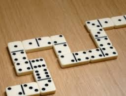

## Exercices programmation orienté objet

**Exercice 1** :  

On souhaite caractériser la notion de point telle qu'elle existe en deux dimensions : aussi bien en coordonnées cartésiennes qu'en coordonnées polaires.
Une version simplifiée est la suivante.

```python
import math
x=float(input("abscisse : "))
y=float(input("ordonnée : "))
if (x>0):
    θ=math.atan(y/x)
if (x<0) and (y>=0):
    θ=math.atan(y/x)+math.pi
if (x<0) and (y<0):
    θ=math.atan(y/x)-math.pi
if (x==0) and (y>0):
    θ=math.pi/2
if (x==0) and (y<0):
    θ=-math.pi/2
if (x==0) and (y==0):
    θ=0
θ=180*θ/math.pi
r=math.sqrt(x**2+y**2)
print("le rayon r vaut :",r," et l'angle θ(degré) vaut : ",θ)
```
Réaliser une classe Point pour réaliser ceci : /Users/vincentlesieux/Documents/Boulot/Computing/SNT/Theme_5_Localisation_cartographie_mobilite/Cours_Localisation_cartographie_et_mobilite.md

```python
>>> A=Point(-2,5)
>>> A.convertis()
le rayon r vaut : 5.385164807134504  et l'angle θ(degré) vaut :  111.80140948635182
>>> B=Point(5,5)
>>> B.convertis()
le rayon r vaut : 7.0710678118654755  et l'angle θ(degré) vaut :  45.0
```

On créera deux méthodes privées `get_θ` et `get_r` et une méthode publique `convertis`.

**Exercice 2** : 

Le domino est un jeu très ancien composé de 28 pièces toutes différentes. Sur chacune de ces pièces, il y a deux côtés constitués de 0 (blanc) à 6 points. Lorsque deux côtés possèdent le même nombre de points, on l'appelle domino double.
<p align="center"></p>


1. Proposer une classe Domino permettant de représenter une pièce. Les objets seront initialisés par les valeurs portées par les des deux côtés (gauche et droite). On définit des méthodes `est_double` et `est_blanc` pour tester si le domino est double ou blanc. On ajoutera également une méthode `affiche` qui affiche les valeurs des deux faces de manière horizontale pour un domino classique et de manière verticale pour un domino double.

2. Proposer une classe JeuDeDomino permettant de manipuler le jeu de domino complet. On créera une méthode pour créer les dominos (les mettre dans `jeu`), pour les `mélanger`, puis pour les `distribuer` en les affichant. 

Indication : on utilisera la méthode random.shuffle(mylist)
   
```python
>>> import random

mylist = ["apple", "banana", "cherry"]
random.shuffle(mylist)
>>> mylist
['banana', 'apple', 'cherry']
```
   

3. On créera également une méthode `couples_de_dominos` pour réaliser des couples de dominos, puis une méthode `affichage_de_dominos_couples` pour afficher ces couples.


```python
>>> jeu = JeuDeDomino()
>>> jeu.creer()
>>> jeu.distribuer()
Joueur 1
 __________
|          |
|    0     |
|__________|
|    0     |
|__________|
 _______________
|              | 
|   1   |   0  |
|              |
‾‾‾‾‾‾‾‾‾‾‾‾‾‾‾
 __________
|          |
|    1     |
|__________|
|    1     |
|__________|
 _______________
|              | 
|   2   |   0  |
|              |
‾‾‾‾‾‾‾‾‾‾‾‾‾‾‾
 _______________
|              | 
|   2   |   1  |
|              |
‾‾‾‾‾‾‾‾‾‾‾‾‾‾‾
 __________
|          |
|    2     |
|__________|
|    2     |
|__________|
 _______________
|              | 
|   3   |   0  |
|              |
‾‾‾‾‾‾‾‾‾‾‾‾‾‾‾
_________________
Joueur 2
 _______________
|              | 
|   3   |   1  |
|              |
‾‾‾‾‾‾‾‾‾‾‾‾‾‾‾
 _______________
|              | 
|   3   |   2  |
|              |
‾‾‾‾‾‾‾‾‾‾‾‾‾‾‾
 __________
|          |
|    3     |
|__________|
|    3     |
|__________|
 _______________
|              | 
|   4   |   0  |
|              |
‾‾‾‾‾‾‾‾‾‾‾‾‾‾‾
 _______________
|              | 
|   4   |   1  |
|              |
‾‾‾‾‾‾‾‾‾‾‾‾‾‾‾
 _______________
|              | 
|   4   |   2  |
|              |
‾‾‾‾‾‾‾‾‾‾‾‾‾‾‾
 _______________
|              | 
|   4   |   3  |
|              |
‾‾‾‾‾‾‾‾‾‾‾‾‾‾‾
>>> jeu.affichage_de_dominos_couples()
 _______________
|              | 
|   4   |   0  |
|              |
‾‾‾‾‾‾‾‾‾‾‾‾‾‾‾
 __________
|          |
|    0     |
|__________|
|    0     |
|__________|
********************************
 _______________
|              | 
|   3   |   1  |
|              |
‾‾‾‾‾‾‾‾‾‾‾‾‾‾‾
 _______________
|              | 
|   1   |   0  |
|              |
‾‾‾‾‾‾‾‾‾‾‾‾‾‾‾
********************************
 _______________
|              | 
|   4   |   1  |
|              |
‾‾‾‾‾‾‾‾‾‾‾‾‾‾‾
 _______________
|              | 
|   1   |   0  |
|              |
‾‾‾‾‾‾‾‾‾‾‾‾‾‾‾
********************************
 _______________
|              | 
|   3   |   1  |
|              |
‾‾‾‾‾‾‾‾‾‾‾‾‾‾‾
 __________
|          |
|    1     |
|__________|
|    1     |
|__________|
********************************
 _______________
|              | 
|   4   |   1  |
|              |
‾‾‾‾‾‾‾‾‾‾‾‾‾‾‾
 __________
|          |
|    1     |
|__________|
|    1     |
|__________|
********************************
 _______________
|              | 
|   3   |   2  |
|              |
‾‾‾‾‾‾‾‾‾‾‾‾‾‾‾
 _______________
|              | 
|   2   |   0  |
|              |
‾‾‾‾‾‾‾‾‾‾‾‾‾‾‾
********************************
 _______________
|              | 
|   4   |   2  |
|              |
‾‾‾‾‾‾‾‾‾‾‾‾‾‾‾
 _______________
|              | 
|   2   |   0  |
|              |
‾‾‾‾‾‾‾‾‾‾‾‾‾‾‾
********************************
 _______________
|              | 
|   3   |   2  |
|              |
‾‾‾‾‾‾‾‾‾‾‾‾‾‾‾
 _______________
|              | 
|   2   |   1  |
|              |
‾‾‾‾‾‾‾‾‾‾‾‾‾‾‾
********************************
 _______________
|              | 
|   4   |   2  |
|              |
‾‾‾‾‾‾‾‾‾‾‾‾‾‾‾
 _______________
|              | 
|   2   |   1  |
|              |
‾‾‾‾‾‾‾‾‾‾‾‾‾‾‾
********************************
 _______________
|              | 
|   3   |   2  |
|              |
‾‾‾‾‾‾‾‾‾‾‾‾‾‾‾
 __________
|          |
|    2     |
|__________|
|    2     |
|__________|
********************************
 _______________
|              | 
|   4   |   2  |
|              |
‾‾‾‾‾‾‾‾‾‾‾‾‾‾‾
 __________
|          |
|    2     |
|__________|
|    2     |
|__________|
********************************
 __________
|          |
|    3     |
|__________|
|    3     |
|__________|
 _______________
|              | 
|   3   |   0  |
|              |
‾‾‾‾‾‾‾‾‾‾‾‾‾‾‾
********************************
 _______________
|              | 
|   4   |   3  |
|              |
‾‾‾‾‾‾‾‾‾‾‾‾‾‾‾
 _______________
|              | 
|   3   |   0  |
|              |
‾‾‾‾‾‾‾‾‾‾‾‾‾‾‾
********************************```

Indication :
Pour obtenir les 28 pièces, sans répétition du symétrique, car ainsi pour un i donné, on forme tous les couples (i,j) possibles :

```python
jeu=[]
for i in range(7):
    for j in range(i+1):
        jeu.append((i,j))
print(jeu)
>>> %Run Domino.py
[(0, 0), (1, 0), (1, 1), (2, 0), (2, 1), (2, 2), (3, 0), (3, 1), (3, 2), (3, 3), (4, 0), (4, 1), (4, 2), (4, 3), (4, 4), (5, 0), (5, 1), (5, 2), (5, 3), (5, 4), (5, 5), (6, 0), (6, 1), (6, 2), (6, 3), (6, 4), (6, 5), (6, 6)]

```

```python
import random

class Domino:
    def __init__(self, gauche, droite):
        self.gauche = gauche
        self.droite = droite

    def est_double(self):
        """
        Vérifie si le domino est un double.

        >>> Domino(3, 3).est_double()
        True
        >>> Domino(2, 5).est_double()
        False
        """
        pass

    def est_blanc(self):
        """
        Vérifie si le domino est un double blanc.

        >>> Domino(0, 0).est_blanc()
        True
        >>> Domino(0, 3).est_blanc()
        False
        """
        pass

    def affiche(self):
        """
        Affiche un domino double verticalement sinon horizontalement
        >>> domino=Domino(4,4)
        >>> domino.affiche()
         __________
        |          |
        |    4     |
        |__________|
        |    4     |
        |__________|
        >>> domino=Domino(3,4)
        >>> domino.affiche()
         _______________
        |              | 
        |   3   |   4  |
        |              |
        ‾‾‾‾‾‾‾‾‾‾‾‾‾‾‾
        """
        if self.gauche != self.droite:
            print(" _______________")
            print("|              | ")
            print(f"|   {self.gauche}   |   {self.droite}  |")
            print("|              |")
            print("‾‾‾‾‾‾‾‾‾‾‾‾‾‾‾")
        else:
            print(" __________")
            print("|          |")
            print(f"|    {self.gauche}     |")
            print("|__________|")
            print(f"|    {self.gauche}     |")
            print("|__________|")


class JeuDeDomino:
    def __init__(self):
        self.jeu = []
        self.joueur1 = []
        self.joueur2 = []

    def creer(self):
		pass

    def melanger(self):
		pass

    def distribuer(self):
		pass
            
    
    def couples_de_dominos(self):
        """
        Renvoie la liste des couples compatibles entre joueur1 et joueur2.
        
        >>> j = JeuDeDomino()
        >>> j.joueur1 = [Domino(1, 2), Domino(5, 3)]
        >>> j.joueur2 = [Domino(3, 1), Domino(2, 4), Domino(5, 1)]
        >>> [(d1.gauche, d1.droite, d2.gauche, d2.droite) for d1, d2 in j.couples_de_dominos()]
        [(3, 1, 1, 2), (1, 2, 2, 4), (5, 1, 1, 2), (5, 3, 3, 1), (5, 1, 5, 3)]
        """
		pass
    
    
    def affichage_de_dominos_couples(self):
		pass
                
                
if __name__ == '__main__':
    import doctest
    doctest.testmod(verbose=True)

```