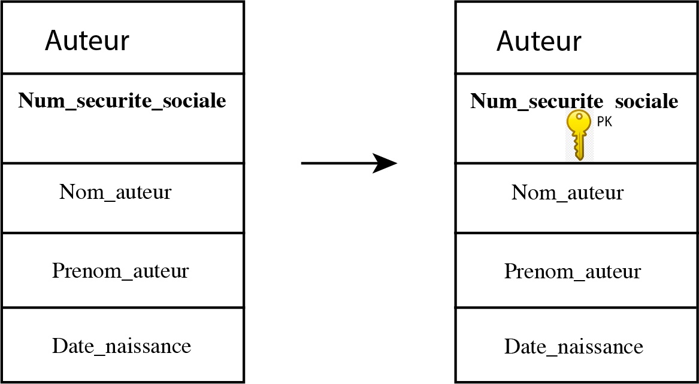
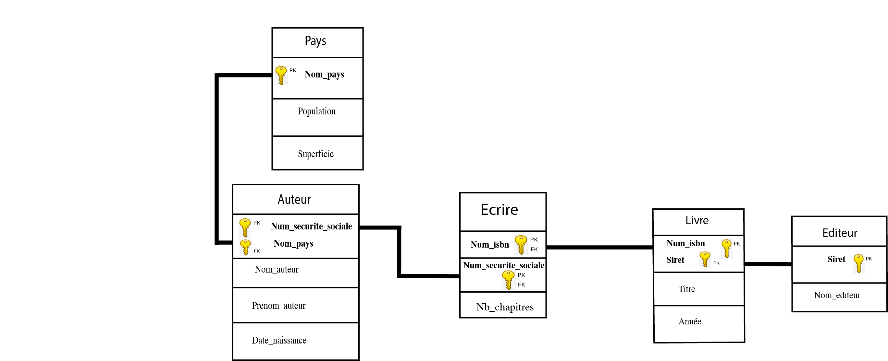
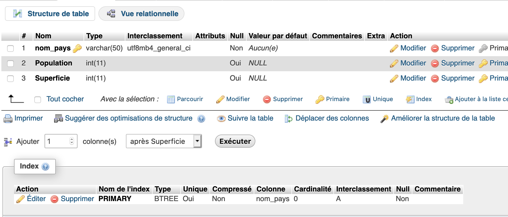

# Les bases de données


## 1) Définitions

Une **base de données BDD** représente un ensemble ordonné de données dont l'organisation est régi par un modèle de données.
Le **Système de Gestion de Bases de Données SGBD** peut être vu comme le logiciel qui prend en charge la **structuration**, la **mise à jour** et la **maintenance** des données. C'est en fait l'interface entre la base de données et les multiples utilisateurs ou leurs programmes.

Quasiment toutes les bases de données utilisées de nos jours sont basées sur les travaux d'Edgar F.Codd (1970).

## 2 ) Conception des bases de données relationnelles

La modélisation se réalise en trois étapes principales qui correspondent à trois niveaux d'abstraction différents: 
- Niveau conceptuel : représentation de la base de données indépendamment de toute considération informatique
- Niveau logique : adaptation du schéma conceptuel en tableaux à deux dimensions
- Niveau physique : implémentation informatique sur un système de gestion de bases de données relationnelles.

## 3 ) Le modèle entité-association

Ce modèle permet de distinguer les entités qui constituent la base de données et les associations entre ces entités.

On parle d'**entité** un objet pouvant être identifié distinctement. Chaque entité est donc unique et est décrite par un ensemble de propriétés appelées **attributs**. Un ou plusieurs attributs permettent d'identifier de manière unique une entité ; on parle alors d'**identifiant**. 

On peut se représenter une entité par le schéma suivant : 

<table border="1" width="20%" style="border-collapse:collapse;border-top:5px solid green;" bgcolor=#E3E4FA>
<tr>
<td>Nom de l'entité</td>
</tr>
<tr>
<td><strong>Identifiant</strong></td>
</tr>
<tr>
<td>Attribut 1</td>
</tr>
<tr>
<td>Attribut 2</td>
</tr>
</table>

Prenons l'exemple d'une entité "Auteur". Un auteur est bien identifié de manière unique par son numéro de sécurité sociale (Num_securite_sociale) de type entier, par son nom (Nom_auteur) et son prénom (Prenom_auteur) de type chaîne de caractères, et une date de naissance (Date_naissance) de type date.

<table border="1" width="20%" style="border-collapse:collapse;border-top:5px solid green;" bgcolor=#E3E4FA>
<tr>
<td>Auteur</td>
</tr>
<tr>
<td><strong>Num_securite_sociale</strong></td>
</tr>
<tr>
<td>Nom</td>
</tr>
<tr>
<td>Prénom</td>
</tr>
<tr>
<td>Date_naissance</td>
</tr>
</table>

Une entité peut avoir un nombre donné d'**occurences** dans la table ; trois occurences dans la table ci-dessous.

<table border="1" width="20%" style="border-collapse:collapse;border-top:5px solid green;" bgcolor=#E3E4FA>
<tr>
<td><strong>Num_securite_sociale</strong></td>
<td><strong>Nom_auteur</strong></td>
<td><strong>Prenom_auteur</strong></td>
<td><strong>Date_naissance</strong></td>
</tr>
<tr>
<td><strong>182086926825812</strong></td>
<td><strong>Dupond</strong></td>
<td><strong>Louis</strong></td>
<td><strong>20/08/1982</strong></td>
</tr>
<tr>
<td><strong>274037511510792</strong></td>
<td><strong>Martin</strong></td>
<td><strong>Lucie</strong></td>
<td><strong>11/03/1974</strong></td>
</tr>
<tr>
<td><strong>1631113826322757</strong></td>
<td><strong>Lefranc</strong></td>
<td><strong>Pierre</strong></td>
<td><strong>05/11/1963</strong></td>
</tr>
</table>

Ces occurences sont appelées **tuples** ou lignes.

Une **association** définit un lien **sémantique** entre entités.
Une association est à minima caractérisée par :
- un nom : généralement on utilise un verbe définissant le lien entre les entités
- deux **cardinalités** : elles sont présentes sur les deux extrémités du lien ; chaque cardinalité est un couple de valeurs (mini,maxi) qui traduisent deux règles de gestion (une par sens).

Dans l'exemple suivant, on définit une association intitulée " Être originaire de " entre les entités "Auteur" et "Pays". 

  

La cardinalité dans le sens Auteur-Pays vaut (1,1) car au minimum comme au maximum un auteur n'est originaire que d'un seul pays.
La cardinalité dans le sens Pays-Auteur vaut (0,n) car au minimum le pays ne peut avoir aucun auteur et au maximum un nombre non défini d'auteurs.

Le schéma ci-dessous montre comment il est possible d'élaborer le **schéma conceptuel des données** pour une gestion de livres.

  

## 4 ) Le modèle relationnel

Dans le modèle relationnel, les entités et les associations du schéma conceptuel sont transformées en tableaux à deux dimensions appelés **relations**.
La transformation d'une entité en relation se fait simplement ; l'identifiant constitue ce que l'on appelle la **clé primaire** ou **Primary Key PK** tandis que l'ensemble des valeurs possibles d'un attribut définit un **domaine**.
On notera par exemple la relation "Auteur" précédente de la manière suivante :
**Auteur**(<u>Num_securite_sociale</u>,Nom_auteur,Prenom_auteur,Date_naissance) ; le nom de la relation est ainsi en gras et la clé primaire est soulignée.

  

Pour transformer une association en relation, deux cas de figure se présentent :

### Cas d'une association possédant au moins une cardinalité (0,1) ou (1,1)

 

 On a ajouté l'attribut Nom_pays à la relation Auteur ; cet attribut constitue la clé primaire de la relation Pays ; cet attribut devient une **clé étrangère** ou **Foreign Key FK** pour la relation Auteur ; dans la représentation, ces deux attributs sont reliés entre eux.

 L'écriture textuelle sera :  
 **Auteur**(<u>Num_securite_sociale</u>,#Nom_pays,Nom_auteur,Prenom_auteur,Date_naissance) 
 La clé étrangère est notée par le symbole hashtag #.

### Cas d'une association sans cardinalité (0,1) ou (1,1)

 

On a transformé l'association Ecrire en relation par l'ajout de deux attributs correspondant respectivement aux clés primaires de chacune des entités. Dans ce cas, il y a deux clés étrangères et ce couple de clés étrangères constitue la clé primaire, d'où la double dénomination PK, FK.

D'où le modèle relationnel complet :
 


## 5 ) Les contraintes d'intégrité

L'**intégrité référentielle** vérifie qu'une valeur de clé étrangère existe bien en tant que valeur de clé primaire dans une autre table. En procédant ainsi les éditeurs seront toujours rattachés à leur livre et l'utilisateur ne pourra pas supprimer involontairement des données essentielles.

## 6 ) Le modèle physique : SGBD relationnel

Un **Système de Gestion de Base de Données ou SGBD** doit répondre aux objectifs suivants : 

- Indépendance physique : la façon dont les données sont définies doit être indépendante des structures de stockage fournies
- Indépendance logique : un même ensemble de données peut être vu différemment par des utilisateurs différents. Toutes ces visions personnelles des données doivent être intégrées dans une vision globale
- Accès aux données : l'accès aux données se fait par l'intermédiaire d'un Langage de Manipulation de Données (LMD). Le LMD doit être optimisé, minimiser le nombre d'accès disques, et tout cela de façon transparente pour l'utilisateur.
- Administration centralisée des données (intégration) : toutes les données doivent être centralisées dans un réservoir unique commun à toutes les applications.
- Non-redondance des données: afin d'éviter les problèmes de mises à jour, chaque donnée ne doit être présente qu'une seule fois dans la base.
- Cohérence des données : les données sont soumises à un certain nombre de contraintes d'intégrité qui définissent un état cohérent de la base. Elles doivent pouvoir être exprimées simplement et vérifiées automatiquement à chaque insertion, modification ou suppression des données.
- Partage des données : il s'agit de permettre à plusieurs utilisateurs d'accéder aux mêmes données au même moment de manière transparente.
- Sécurité des données : les données doivent être protégées contre les accès non autorisés.
- Résistance aux pannes : il faut toujours récupérer une base dans un état sain.

Le SGBD que l'on va utiliser s'appelle **MySQL** ; il en existe d'autres : PostgreSQL, SQLite, Oracle Database, Microsoft SQL Server, Microsoft Access. Le langage utilisé est le langage **SQL** dans la version SQL2.

#### a) Création d'une base de données : voir <a href="https://www.alwaysdata.com/fr/">alwaysdata</a>

#### b) Création d'une relation ou table dans phpMyAdmin

```sql
CREATE TABLE `Pays` (
`nom_pays` VARCHAR(50),
`Population` INTEGER,
`Superficie` INTEGER,
PRIMARY KEY (`nom_pays`)
);
```
Vue dans phpmyadmin 



```sql
CREATE TABLE `Auteur` (
	Num_securite_sociale INT,
	Nom_pays VARCHAR(50),
	Nom_auteur VARCHAR(50) NOT NULL,
	Prenom_auteur VARCHAR(50),
	Date_naissance DATE,
    PRIMARY KEY(Num_securite_sociale),
    UNIQUE(Nom_auteur,Prenom_auteur),
    FOREIGN KEY(Nom_Pays) REFERENCES Pays(Nom_pays)
    ON DELETE CASCADE
    ON UPDATE CASCADE
)
```

Vue dans phpmyadmin 

