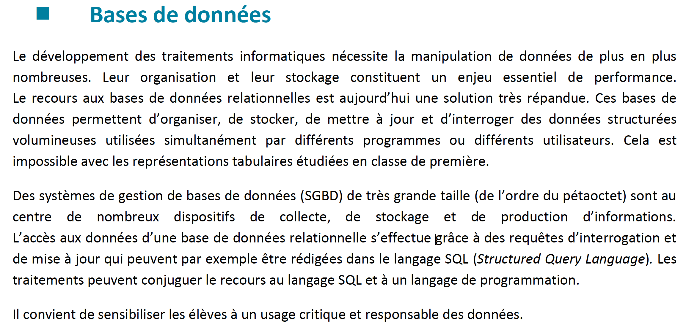
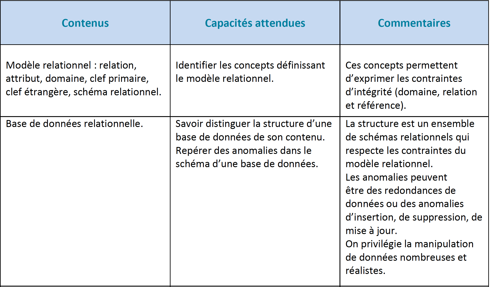
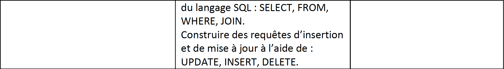
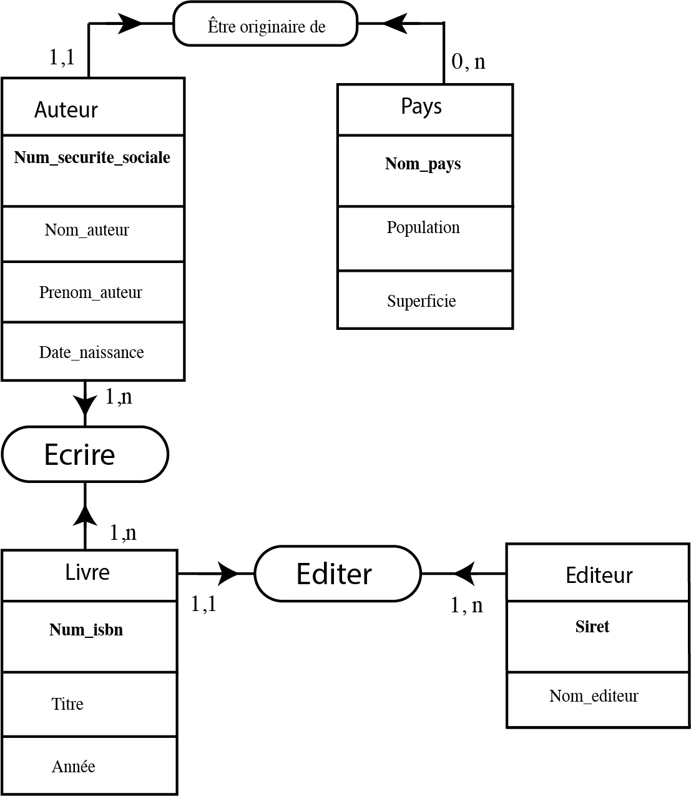

# Les bases de données

## 1) Définitions

Une **base de données BDD** représente un ensemble ordonné de données dont l'organisation est régi par un modèle de données.
Le **Système de Gestion de Bases de Données SGBD** peut être vu comme le logiciel qui prend en charge la **structuration**, la **mise à jour** et la **maintenance** des données. C'est en fait l'interface entre la base de données et les multiples utilisateurs ou leurs programmes.

Quasiment toutes les bases de données utilisées de nos jours sont basées sur les travaux d'Edgar F.Codd (1970).

## 2 ) Conception des bases de données relationnelles

La modélisation se réalise en trois étapes principales qui correspondent à trois niveaux d'abstraction différents: 
- Niveau conceptuel : représentation de la base de données indépendamment de toute considération informatique
- Niveau logique : adaptation du schéma conceptuel en tableaux à deux dimensions
- Niveau physique : implémentation informatique sur un système de gestion de bases de données relationnelles.

## 3 ) Le modèle entité-association

Ce modèle permet de distinguer les entités qui constituent la base de données et les associations entre ces entités.

On parle d'**entité** un objet pouvant être identifié distinctement. Chaque entité est donc unique et est décrite par un ensemble de propriétés appelées **attributs**. Un ou plusieurs attributs permettent d'identifier de manière unique une entité ; on parle alors d'**identifiant**. 

On peut se représenter une entité par le schéma suivant : 

<table border="1" width="20%" style="border-collapse:collapse;border-top:5px solid green;" bgcolor=#E3E4FA>
<tr>
<td>Nom de l'entité</td>
</tr>
<tr>
<td><strong>Identifiant</strong></td>
</tr>
<tr>
<td>Attribut 1</td>
</tr>
<tr>
<td>Attribut 2</td>
</tr>
</table>

Prenons l'exemple d'une entité "Auteur". Un auteur est bien identifié de manière unique par son numéro de sécurité sociale (Num_securite_sociale) de type entier, par son nom (Nom_auteur) et son prénom (Prenom_auteur) de type chaîne de caractères, et une date de naissance (Date_naissance) de type date.

<table border="1" width="20%" style="border-collapse:collapse;border-top:5px solid green;" bgcolor=#E3E4FA>
<tr>
<td>Auteur</td>
</tr>
<tr>
<td><strong>Num_securite_sociale</strong></td>
</tr>
<tr>
<td>Nom</td>
</tr>
<tr>
<td>Prénom</td>
</tr>
<tr>
<td>Date_naissance</td>
</tr>
</table>

Une entité peut avoir un nombre donné d'**occurences** dans la table ; trois occurences dans la table ci-dessous.

<table border="1" width="20%" style="border-collapse:collapse;border-top:5px solid green;" bgcolor=#E3E4FA>
<tr>
<td><strong>Num_securite_sociale</strong></td>
<td><strong>Nom_auteur</strong></td>
<td><strong>Prenom_auteur</strong></td>
<td><strong>Date_naissance</strong></td>
</tr>
<tr>
<td><strong>182086926825812</strong></td>
<td><strong>Dupond</strong></td>
<td><strong>Louis</strong></td>
<td><strong>20/08/1982</strong></td>
</tr>
<tr>
<td><strong>274037511510792</strong></td>
<td><strong>Martin</strong></td>
<td><strong>Lucie</strong></td>
<td><strong>11/03/1974</strong></td>
</tr>
<tr>
<td><strong>1631113826322757</strong></td>
<td><strong>Lefranc</strong></td>
<td><strong>Pierre</strong></td>
<td><strong>05/11/1963</strong></td>
</tr>
</table>

Ces occurences sont appelées **tuples** ou lignes.

Une **association** définit un lien **sémantique** entre entités.
Une association est à minima caractérisée par :
- un nom : généralement on utilise un verbe définissant le lien entre les entités
- deux **cardinalités** : elles sont présentes sur les deux extrémités du lien ; chaque cardinalité est un couple de valeurs (mini,maxi) qui traduisent deux règles de gestion (une par sens).

Dans l'exemple suivant, on définit une association intitulée " Être originaire de " entre les entités "Auteur" et "Pays". 

La cardinalité dans le sens Auteur-Pays vaut (1,1) car au minimum comme au maximum un auteur n'est originaire que d'un seul pays.
La cardinalité dans le sens Pays-Auteur vaut (0,n) car au minimum le pays ne peut avoir aucun auteur et au maximum un nombre non défini d'auteurs.

Le schéma ci-dessous montre comment il est possible d'élaborer le **schéma conceptuel des données** pour une gestion de livres.

