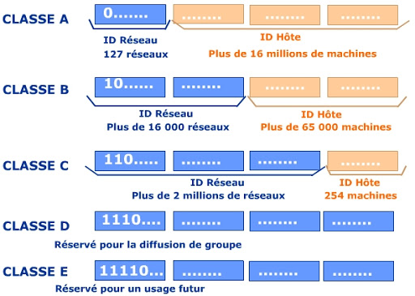

# Réseaux et sécurité

## Histoire

Internet, en tant que réseau, n'a pas été inventé, il s'est constitué progressivement au fur et à mesure de l'apparition des technologies. Il en a été de même pour les services qu'il propose, innombrables et d'une grande diversité. Aujourd'hui la sécurisation est un enjeu majeur dans le monde Internet (données, communications...).

- Environ -50 avant J.C, Jules César utilise le code de César pour chiffer des messages.
- 1958 : premier modem permettant de transmettre des données entre deux ordinateurs
- 1983 : Le protocole TCP/IP devient le standard pour les réseaux
- 1993 : Le CERN de Genève présente le Web
- 1993 : Le routage IP devient la norme en IPv4
- 1994 : HTTPS sécurise HTTP
- 1998 : IPv6 améliore le routage et intègre IPSec
- 2004 : Wifi 802.11i : sécurisation des communications sans fil
- 2006 : SSH-2 : solution actuelle de prise de commande à distance sécurisée

## L'infrastructure d'Internet

### Le maillage

Internet est né de l'interconnexion de très nombreux réseaux locaux, de norme, de taille et d'organisation très différentes.

### Les machines

Les éléments d'infrastructure sont nombreux et de nature très hétérogènes :

- ordinateurs : personnels, fixes ou portables, serveurs : leurs caractéristiques sont diverses (performances, système d'exploitation, applications...)
- terminaux mobiles : les téléphones, tablettes, consoles de jeux, sont aujourd'hui intégrés à l'infrastructure internet
- périphériques : la plupart des périphériques mis sur le marché sont connectables à Internet
- objets connectés : en pleine expansion, le monde des objets connectés est de nature entièrement intégré à Internet
- commutateurs : au coeur des réseaux locaux, ce sont eux qui sont en charge de l'interconnexion des équipements terminaux
- ponts : cette famille d'équipements gère l'interconnexion des infrastructures de nature ou norme différente
- routeurs : en charge du traffic à travers le maillage Internet, ils permettent à l'information de transiter d'un émmetteur à un destinataire, par un chemin satisfaisant à des contraintes structurelles, organisationnelles ou temporelles.

## Le protocole TCP-IP

### Un protocole universel

Internet est constitué de l'interconnexion de très nombreux réseaux, de norme, de taille et d'organisation très différentes. De manière évidente, les hôtes constituant chacun de ces réseaux sont aussi de nature très différentes : les ordinateurs (serveurs, clients, mobiles...), des périphériques, des téléphones, ainsi que tous les éléments d'infrastructure (commutateurs, routeurs, points d'accès Wifi...)
Devant l'hétérogénéité de ces équipements, la création d'un protocole de communication uiversel s'est imposée : le protocole de communication IP (Internet Protocol) a donc été présenté, permettant l'interconnexion de systèmes hétérogènes, indépendamment des supports de transmission, des normes d'infrastructure réseau, des systèmes d'exploitation ou des applications utilisées.
IP est aujourd'hui devenu le protocole de communication universel ; un protocole est un ensemble de caractéristiques sur lesquelles vont s'appuyer deux entités différentes pour rendre possible une action commune.

### La pile TCP-IP

Le protocole IP est l'un des membres d'une famille de protocoles que l'on nomme couramment la pile TCP/IP. Dans la plupart des cas, il est associé au protocole TCP, d'où l'appellation courante TCP/IP, mais il peut communiquer avec d'autres protocoles.
La version d'IP la plus fréquente est IPv4 mais une nouvelle version IPv6 a été normalisée.

### Le datagramme IP

La première tâche du protocole IP consiste à scinder les données provenant des applications en paquets de taille constante, puis de les mettre dans un format défini appelé datagramme IP pour pouvoir les émettre sur le réseau.
Le protocole IP propose un service : 

- non fiable : IP véhicule les datagrammes IP entre un émetteur et un destinataire à travers le maillage d'un réseau sans aucune garantie de remise au destinataire. La gestion des erreurs est simplifiée : en cas de constat d'erreur dans les données reçues, une demande de réémission du datagramme erroné est transmise à son émetteur.
- sans connexion : IP émet les datagrammes IP en mode non connecté : chaque datagramme IP émis fera l'ojet d'un routage indépendant. IP ne dispose pas de connaissance sur l'état des lignes de transmission (principalement leur débit ou une coupure de ligne), l'ordre de réception peut différer de celui d'émission.

### Les adresses IP

Pour permettre le transport des datagrammes, chacun des éléments d'une infrastructure (hôtes, serveurs, périphériques, objets connectés, commutateurs administrables, routeurs...) doit posséder une adresse unique sur le réseau : son adresse IP.
L'adresse IP est utilisée :
- pour identifier chaque élément dans l'infrastructure. 

- pour réaliser le routage des datagrammes IP dans celles-ci. 
  L'adresse IP d'un ordinateur est une suite de 32 bits (soit 4 octets) habituellement représentée en notation décimale pointée, de la forme x1.x2.x3.x4. 
  Ces quatre octets regroupent :

- l'identifiant du réseau auquel appartient l'ordinateur appelé le rID ou ID Réseau : 0 pour la classe A, 10 pour la classe B, 110 pour la classe C, 1110 pour la classe D, 11110 pour la classe E.  

- l'identifiant de l'ordinateur à l'intérieur du réseau : oID ou ID Hôte.

  Les adresses IP sont divisées en 5 classes, notées classes A à classe E, définies par le premier octet de l'adresse. 
  Les différentes classes sont décrites dans le schéma ci-dessous.




La **classe A** regroupe un petit nombre de très grands réseaux (réseaux nationaux, gouvernementaux, armées, grands opérateurs de télécommunications...) : exactement 2<sup>7</sup> réseaux. Notons qu'il n'y a plus aujourd'hui d'adresse de classe A disponible pour des réseaux qui en auraient la nécessité ; les adresses de classe A comptent 2<sup>24</sup>-2 soit 16 777 216 hôtes. Le dernier octet va en effet de 1 à 254.

Les adresses de réseaux de **classe B** sont plus nombreuses. Elles comportent  2<sup>14</sup>=16384 réseaux et elles permettent d'identifier des réseaux de taille relativement importante (jusqu'à 65 534 éléments adressables :2<sup>16</sup>-2 ). Leur nombre est cependant restreint et comme pour les adresses de classe A, les adresses de classe B sont actuellement totalement attribuées.

Les adresses de **classe C** sont destinées aux réseaux locaux qui ne comptent qu'un nombre peu élevé d'ordinateurs (254 au maximum) ; il y a 2<sup>21</sup>=2 097 152 réseaux.
Au niveau mondial les adresses IP sont réparties par l'IANA (Internet Assigned Numbers Authority) entre les différents registres régionaux d'adresses Internet ou RIR (Regional Internet Registries) représentant chacune une zone géographique du monde.
Certaines adresses, par exemple 192.168.0.0 à 192.168.255.0, sont des adresses réservées destinées aux réseaux locaux. Exemple : l'adresse 192.8.13.20  est une adresse de classe C où 20 est l'identifiant de l'hôte dans le réseau.


## Le routage

### Mode non connecté et mode connecté

En **mode non connecté**, les données envoyées par la machine source sont découpées en paquets avant leur envoi. Ces paquets ou datagrammes sont alors acheminés dans le réseau indépendanmment les uns des autres.
Dans le cas d'une transmission de données en mode non connecté, aucun contrôle sur le flux d'information n'est effectué. En effet, les données sont émises sans évaluation préalable du traffic ou de la qualité du transfert. C'est le cas pour les transferts de données sur Internet, basés sur des services de niveau réseau sans connexion et non fiable.

> Mode non connecté : certaines applications ne requièrent pas d'établir une connexion avant le début d'un échange : elles fonctionnent en mode non connecté : l'émetteur envoie les données sur le support de transmission et c'est ce dernier qui est en charge de les remettre au destinataire. Remarquons que l'émetteur ne dispose, lorsqu'il soumet le message au réseau, d'aucune information concernant :
- l'état du destinataire qui peut par exemple ne pas être disponible à cet instant
- le temps nécessaire jusqu'à la réception du datagramme
Exemples : le mail (un utilisateur qui envoie un message ne vérifier pas la validité de l'adresse du destinataire), l'achat à distance.

La réalisation d'une communication en **mode connecté** nécessite une phase d'établissement d'une connexion préalablement à l'envoi de données : un circuit virtuel est mis en place. Tous les paquets à véhiculer de la source au destinataire transiteront de manière identique par ce chemin. 
De même l'acquittement de chacun des paquets reçus par les deux extrémités est transmis via le circuit virtuel établi, ce qui permet d'offrir un service fiable sans procédé technique supplémentaire.

> Mode connecté : certaines applications requièrent d'établir la connexion avant le début de l'échange : elles fonctionnent en mode connecté. Un tel échange est caractérisé par trois phases bien distinctes :
1) La connexion
2) L'échange de durée variale
3) La déconnexion qui termine le dialogue
Exemples : la prise en main à distance (effectuer des tâches sur un poste de travail à partir d'un autre poste en réseau), la communication téléphonique

### Principe de routage

Un algorithme de routage a pour rôle d'acheminer un datagramme à travers le réseau. Une telle fonction ne peut donc pas être centralisée, mais doit être présente dans chaque noeud du maillage. Elle doit, pour chaque paquet parvenant au noeud sur l'un de ses ports, choisir sur quel port de sortie l'orienter.  

De manière évidente, un algorithme de routage doit être :

- **déterministe** : face à une situation donnée, une solution unique doit être fournie : aucun choix n'est laissée à l'utilisateur ou au hasard.
- **rapide** : en toutes circonstances, il doit être en mesure définir rapidement une route.
- **équitable** entre les utilisateurs, dont le nombre peut être très important.
- **robuste** : il doit fonctionner en toutes circonstances, même dégradées. 
- **optimisé** : il doit proposer le meilleur chemin possible (en temps, en distance, en encombrement...)

Les algorithmes de routages peuvent être divisés en deux familles principales :

- les **algorithmes non adaptatifs** utilisent un ensemble de routes statiques mises en place par une étude préliminaire. Ils ne tiennent pas en compte de l'état des lignes de transmission au moment de l'envoi du datagramme
- les **algorithmes adaptatifs** précèdent tout envoi de données d'une étude du contexte. Ces algorithmes se basent sur l'observation directe du maillage du réseau ou du trafic sur les lignes à un instant donné. On parle ici de routage dynamique. Les techniques mises en oeuvre sont plus complexes mais sont justififées par les performances obtenues.

### Types d'algorithmes

- Le **routage par inondation** (flooding) est la technique utilisée en mode diffusion. Lorsqu'un datagramme est reçu par un routeur sur l'un de ses ports, il est réémis sur tous les autres ports. De manière évidente, cette méthode engendre un trafic très important sur la totalité des lignes de transmission. Elle ne convient donc pas à des réseaux de taille élevée ou possédant un grand nombre de noeuds.

- Le **routage du plus court chemin** : un réseau maillé peut être représenté par un graphe G=(X,E) dont l'ensemble des sommets X regroupe les routeurs et l'ensemble des arêtes E contient les lignes de transmission. Un chemin entre deux routeurs correspond alors à une chaîne de G, c'est-à-dire à une suite alternée de sommets et d'arêtes. Il est possible d'associer un coût à chaque arête : le réseau peut ainsi être assimilé à un graphe évalué. La recherche du plus court chemin consiste alors à trouver la chaîne dont la somme des arêtes est minimale : ce coût minimal pourra correspondre, en fonction du critère important dans une situation précise, au nombre de routeurs traversés, à la distance géographique ou au trafic sur un chemin...). Le protocole OSPF est basé sur le coût de chaque lien, utilisé pour calculer le coût global du chemin par l'algorithme de Dijkstra.

- Le **routage à vecteur de distance** : créé initiallement pour les réseaux locaux Netware de Novell, puis utilisé par Internet, le routage à vecteur de distance est l'un des premiers algorithmes dynamiques.Chaque élément actif possède en mémoire une table de routage qui lui est propre. Cette structure lui indique, pour chacune des destinations connues, le port de sortie à utiliser, ainsi qu'un port par défaut pour les destinations inconnues. Des communications inter-routeurs permettent de mettre à jour régulièrement la table de routage de chaque routeur à partir des connaissances de ses voisins. Pour le routage dans Internet, cette technique a atteint ses limites car les tales des routeurs peuvent contenir de très nombreuses entrées, et donc entraîner des pertes de temps trop importantes pour parcourir ces tables lors de la recherche d'un destinataire.  

- Le **routage hiérarchique** est basé sur la technique de routage à vecteur de distance mais une réflexion sur la structure des tables de routage a été menée dans le but de limiter le nombre d'entrées à consulter lors de la recherche d'un destinataire.
La solution consiste à diviser le réseau en plusieurs zones géographiques appelées régions. Chaque routeur va alors posséder dans sa table trois types de données :

	- les ports de sortie à emprunter pour accéder à chaque destinataire situé dans sa région
	- les ports de sortie permettant d'accéder à chacune des autres régions du réseau
	- un port de sortie à utiliser par défaut pour une adresse de destinataire inconnu. 
	
	Une telle technique peut être améliorée en mettant en place plusieurs découpages hiérarchiques successifs, c'est-à-dire en divisant chaque zone en plusieurs sous-zones et ceci répété plusieurs fois. Le routage à vecteur de distance sur lequel est basé l'algorithme de routage RIP utilisé sur Internet intègre cette notion de hiérarchie.
	
- Le **routage dans les réseaux sans fil** : dans un réseau sans fil, une difficulté supplémentaire apparaît pour effectuer le routage : les ordinateurs mobiles se déplacent géographiquement à travers le réseau et sont associés pour une durée limitée à un point d'accès sans fil (on appelle cellule la zone géographique correspondant au point d'accès sans fil). Le routage adapté à ces changements de cellules nécessite un algorithme particulier.

	1) Initialement, chaque mobile est associé à un point d'accès de rattachement 
	2) Lorsqu'un mobile arrive dans une nouvelle cellule, il demande sa connexion à la station de base correspondante. Cette phase de connexion nécessite un échange avec sa cellule de rattachement.
	3) La station de base de rattachement enregistre la localisation du mobile dans une table de routage. De même, celle de la nouvelle cellule enregistre l'adresse du mobile dans une table (possédant autant d'entrées qu'il y a de mobiles dans la cellule à cet instant).
	4) La communication peut se réaliser : les données destinées au mobile sont envoyées à sa station de base de rattachement, qui les transmet à son tour à la station de base de la cellule où se trouve le mobile à cet instant. Celle-ci, connaissant l'adresse du mobile grâce à sa table, transmet les données au mobile.

## Le routage IP

Une fois les datagrammes créés, ils sont transmis sur le réseau par la machine émettrice : le protocole IP est alors en charge de les acheminer à travers le maillage du réseau (très complexe lorsque ce réseau est étendu comme Internet). 
Le protocole IP dispose d'une méthode spécifique de routage : le protocole RIP (Routing Information Protocol).
RIP est un algorithme de routage par sauts successifs (Next-Hop Routing) : cette méthode spécifie qu'un routeur ne connaît pas le chemin que va emprunter un datagramme, mais seulement le routeur suivant à qui ce datagramme va être transmis.
Le principe consiste à intégrer à chaque routeur une table de routage proposant le routeur suivant pour chaque destinataire (quelque soit sa nature : machine, réseau, adresse inconnue).

La structure d'une **table de routage RIP** est simple, contenant 4 champs pour définir une route :

- l'**adresse de destination** du datagramme est une adresse IP (d'un hôte, d'un réseau ou d'un routeur de sortie par défaut)
- le **routeur de saut suivant (passerelle)** qui permettra au datagramme d'accéder à un autre réseau (cette adresse est le routeur lui-même si le destinataire est situé sur un réseau directement accessible via une des ses interfaces).
- l'adresse de l'**interface** du routeur à utiliser pour pouvoir accéder au routeur de saut suivant
- la valeur du **vecteur de distance** qui correspond au nombre de sauts à effectuer avant d'atteindre le réseau de la machine destinataire du datagramme. On appelle cette valeur la **métrique** de la route.

Le message RIP est émis par chaque routeur pour transmettre à ses voisins la liste des destinataires (hôtes ou réseaux) pour lesquels il possède une route dans sa table.

<table>
<tr>
<td>Adresse de destination</td><td>Passerelle</td><td>Interface</td><td>Vecteur de distance</td>
</tr>
<tr>
<td>Adresse 1</td><td>Routeur suivant 1</td><td>Interface 1</td><td>2</td>
</tr>
<tr>
<td>Adresse 2</td><td>Routeur suivant 2</td><td>Interface 1</td><td>1</td>
</tr>
<tr>
<td>.....</td><td>....</td><td>.....</td><td>1</td>
</tr>
<tr>
<td>Autres</td><td>Routeur suivant 3</td><td>Interface 5</td><td>1</td>
</tr>
</table>

L'algorithme utilisé par RIP est relativement simple ; il consiste à rechercher dans la table de routage la meilleure route vers le destinataire voulu :

1) Lorsque ce destinataire est connu du routeur, le datagramme lui est transmis directement (si le routeur est directement connecté au réseau de destination) ou au routeur suivant à utiliser
2) Si le réseau du destinataire est connu du routeur, le datagramme est transmis au routeur suivant à utiliser.
3) Si l'adresse est inconnue, le datagramme est transmis au routeur par défaut (pour la route par défaut, le vecteur de distance est toujours de 1).

Le programme en Python suivant correspond au traitement RIP d'un datagramme reçu par un routeur, pour le réémettre sur la route vers son destinataire :

```Python
table_de_routage=[
    ["192.200.7.18","192.200.7.253",3],
    ["192.200.7.0","192.200.7.253",3],
    ["192.190.8.0","192.200.7.254",7],
    ["défaut","192.200.7.254",1]
    ]

trouve=False

adresse_destination=input("Quelle est l'adresse IP du destinataire ?")

#nous parcourons la table de routage

for adresse, routeur_saut_suivant, vecteur_de_saut in table_de_routage:
    
#si nous trouvons un chemin vers le destinataire
    
    if adresse==adresse_destination:
        
        trouve=True
        
        #nous transmettons le datagramme au routeur de saut suivant
        #ou au destinataire s'il est directement accessible
        #envoyer(datagramme, routeur_saut_suivant)
        
        print("Le datagramme est envoyé à",routeur_saut_suivant)
        
    #si nous n'avons pas trouvé le chemin vers le destinataire
        
    if trouve==False:
        
        #nous parcourons à nouveau la table de routage
        
        for adresse, routeur_saut_suivant, vecteur_de_saut in table_de_routage:
            
            #si nous trouvons un chemin vers le réseau du destinataire
            
            if adresse==adresse_réseau_du_destinataire:
                
                trouve=True
                
                #nous transmettons le datagramme au routeur de saut suivant
                #envoyer(datagramme, routeur_saut_suivant)
                print("Le datagramme est envoyé à",routeur_saut_suivant)
    
    #si nous n'avons pas trouvé le chemin vers le destinataire         
                
    if trouve==False:
        
        #nous parcourons à nouveau la table de routage
        
        for adresse, routeur_saut_suivant, vecteur_de_saut in table_de_routage:
            
            #si nous trouvons une route de sortie par défaut
            
            if adresse=="défault":
                
                trouve=True
                
                #nous transmettons le datagramme au routeur par défaut
                #envoyer(datagramme, routeur_saut_suivant)
                print("Le datagramme est envoyé à",routeur_saut_suivant)
                
    if trouve==False:
        print("Impossible de transmettre le datagramme")

```

## TCP et la gestion des erreurs de transmission

Le protocole TCP (Transmission Control Protocol) est un protocole complémentaire au protocole IP dans la pile TCP/IP.
TCP est associé à IP pour améliorer la qualité du service en mettant en place une transmission fiable en mode connecté.
TCP agit à plusieurs niveaux :

- ouverture et fermeture de la connexion
- découpage des données reçues des applications en paquets appropriés à la constitution des datagrammes IP (au maximum 65 536 octets) et réassemblage à l'arrivée si nécessaire
- contrôle de la qualité du service pour conserver un service fiable en mode connecté
- gestion des problèmes de transmission et reprise en cas d'interruption

> Une fois découpées en paquets, les données sont transmises sur le réseau par le protocole IP dans des datagrammes IP. Ces datagrammes sont traités individuellement. À la réception, ces paquets sont réassemblés puis mis à la disposition des applications.
Remarque : si un émetteur envoie plusieurs trames à un même destinataire, toutes n'emprunteront pas forcément le même chemin.

Le support physique n'est pas parfait et des problèmes (perte, corruption...) peuvent survenir au cours de la transmission d'un datagramme entre deux machines. Des méthodes doivent être mises en place pour rendre ces problèmes d'erreurs transparents aux applications.

Deux types de problème peuvent se poser au cours d'un échange :

- la détection, à la réception, d'une erreur de transmission dans le datagramme, doit entraîner un traitement spécifique : correction de l'erreur si une méthode correctrice est disponible ou envoi d'une demande de retransmission dans le cas contraire
- la perte d'un datagramme doit être détectée et gérée de façon à reconstituer le message émis initialement

Une méthode de détection d'erreurs doit permettre de constater qu'une erreur est apparue dans le datagramme. Elle ne fournit aucun détail sur le nombre d'erreurs, leur localisation, leurs conséquences sur les données...Son seul but est de signaler que le datagramme reçu est différent de celui envoyé, et donc de demander à l'émetteur une retransmission du datagramme endommagé.

Une méthode de correction d'erreurs est beaucoup plus complexe qu'une méthode simplement détectrice. Elle doit transmettre en plus des données tout ce qui est nécessaire à les reconstituer en cas de constat d'erreur à l'arrivée. La complexité de ce type de méthode et la perte de temps importante générée en font des outils peu utilisés dans les réseaux actuels.

La méthode la plus utilisée pour gérer les pertes de datagramme dans les échanges entre deux machines est basée sur l'utilisation d'accusés de réceptions (acquittements).

Le principe de base consiste à faire envoyer un datagramme spécifique par le récepteur, accusant réception du datagramme qu'il vient de recevoir :
- lorsque l'émetteur reçoit l'accusé de réception du datagramme qu'il a envoyé, il peut émettre le datagramme suivant
- si l'émetteur ne reçoit pas d'accusé de réception dans un délai de temps défini, il renvoie ce datagramme

Concrètement, l'acquittement du datagramme reçu est réalisé par le champ Numéro d'acquittement dans un datagramme de réponse retourné à l'émetteur.

Pour améliorer cette méthode, TCP propose un mécanisme de fenêtre : un nombre défini de datagrammes sont envoyés en continu par l'émetteur sans attendre un accusé de réception. Ce nombre de datagrammes envoyés est ce que l'on appelle la taille de la fenêtre TCP.

## La sécurisation des communications

### Les besoins

Pour mettre en place une communication sécurisée, plusieurs techniques sont complémentaires :
- l'**authentification** des extrémités : cette phase, prérequis indispensable à toute communication, est basée sur un système de clés de sécurité (symétrique ou asymétrique).
- la **confidentialité** : assurée par un algorithme de chiffrement qui a pour objectif que le contenu de la communication ne soit pas lisible par un tiers. De même que pour l'authentification, le chiffrement est basé sur un système de clés (symétriques ou asymétriques).
- l'**intégrité** des données : les deux extrémités de la communication ont la garantie que les données ne sont pas modifiées entre eux
- la gestion d'**autorisations** : il est possible d'appliquer des droits aux utilisateurs, selon la stratégie de sécurité définie pour chaque nature de communication.

### Principes de chiffrement

Le principe de base de la sécurisation d'une communication consiste à modifier la donnée qui doit être transmise (le chiffrement) de façon à ce que toute personne qui l'intercepterait ne pourrait pas en comprendre le sens. Seul le destinataire va pouvoir retrouver la donnée initiale (le déchiffrement) et la lire.
Les méthodes de chiffrement sont basées sur l'utilisation de clés (des chaînes de caractères numériques) qui vont, par l'application d'algorithmes spécialisés, permettre de chiffrer ou déchiffrer des messages.

> Le chiffrement d'un message consiste à le modifier pour le rendre illisible par une personne qui n'y est pas autorisée. Le chiffrement (puis le déchiffrement) est effectué par l'application au message initial d'une fonction mathématique, basée sur une donnée convenue entre les deux extrémités appelée clé de chiffrement.

Dans ce domaine, deux principales techniques sont disponibles : le chiffrement symétrique ou asymétrique. Les protocoles actuels utilisent selon leur nature l'une ou l'autre, ou la combinaison des deux méthodes (HTTPS, le protocole de base du Web par exemple).


### Chiffrement symétrique

Cette technique consiste à définir une clé de chiffrement, dite clé publique, commune à l'ensemble des interlocuteurs. Cette clé va servir à chiffrer les données lors de leur envoi, et de les déchiffrer à leur réception. 
Une phase initiale de définition de la clé publique est nécessaire. Cette clé est ensuite communiquée à tous les ordinateurs susceptibles d'échanger des données.
Chaque ordinateur peut à son tour être emetteur ou récepteur ; selon le contexte, il utilise la clé publique pour chiffrer (en émission) ou déchiffrer (en réception).

### Chiffrement asymétrique

Le principe de chiffrement asymétrique (appelé aussi cryptographie asymétrique ou cryptographie à clé publique) est basé sur l'utilisation de 2 clés :
- une clé privée est définie sur le poste client et stockée sur celui-ci de manière sécurisée.
- une clé publique est diffusée par le client à tous les postes distants.
Le transport sécurisé des données est ensuite assuré par leur chiffrement : la clé publique sert à chiffrer et la clé privée est utilisée pour déchiffrer.
Ce dispositif nécessite qu'un ordinateur possède les clés publiques de tous les postes susceptibles de lui envoyer un message.
Notons que le chiffrement asymétrique est aussi employé pour permettre l'authentification de l'expéditeur d'un message : pour certifier qu'un message provient bien de lui, l'émetteur va utiliser sa clé privée pour chiffrer un message (l'inverse du principe général).Le récepteur le déchiffre grâce à sa clé publique : s'il peut le faire, c'est que ce message a bien été chiffré par l'émetteur, car c'est le seul à détenir la clé privée.

> Le concept de signature numérique est basé sur cette technique d'authentification par chiffrement asymétrique.

### HTTPS

HTTP est le protocole de base du Web : il est en charge des requêtes d'affichage des pages Web. HTTP est un protocole non sécurisé : il a donc été nécessaire de lui ajouter des outils assurant la sécurité des transmissions des pages.
Les protocoles SSL (Secure Socket Layer) puis TLS (Transport Layer Security) apportent une couche supplémentaire permettant la sécurisation des échanges de façon transparente pour HTTP.

> L'association des protocoles HTTP et TLS porte généralement le nom de HTTPS.

Basés sur un chiffrement asymétrique, SSL et TLS apportent à HTTP la sécurisation nécessaire entre un serveur Web et la navigateur Internet d'un ordinateur client :

- l'échange sécurisé des clés
- l'authentification du client et du serveur
- la confidentialité des transmissions par le mécanisme de chiffrement

### Autres exemples

**SSH** est le protocome de référence de prise de commande à distance sécurisé (Secure SHell). Le principe de base est la possibilité de se connecter, à partir d'un client SSH, à une autre machine (sur laquelle est installé un serveur SSH) pour exécuter des commandes sur celle-ci. Le client SSH peut prendre la forme d'une application en ligne de commandes (shell) ou d'une application graphique.
Techniquement, SSH reprend les fonctionnalités communes à toutes les communications sécurisées : authentification (basée sur une méthode de chiffrement asymétrique), confidentialité (plusieurs algorithmes de chiffrement possibles), intégrité des données, autorisations (possibilité de donner des droits différents selon les utilisateurs).

Le principe d'une **infrastructure Wifi** est de permettre une communication sans utiliser de support physique matériel, par onde radio.
L'infrastructure est centralisée autour d'un point d'accès Wifi. Chaque station (ordinateur portable, smartphone, consolde de jeux, imprimante...) met en place une connexion avec le point d'accès : l'ensemble des éléments ainsi connectés constitue une cellule Wifi.
L'emploi d'un protocole de chiffrement permet de sécuriser les transmissions de données entre le point d'accès et les stations. Le protocole de chiffrement utilisé actuellement est WPA2 (Wifi Protected Access) basé sur l'utilisation d'une clé de chiffrement publique, connue de tous les éléments autorisés et utilisée pour chiffrer (émission) et déchiffrer (réception) les trames. Le chiffrement est réalisé par un algorithme spécifique appelé AES.
