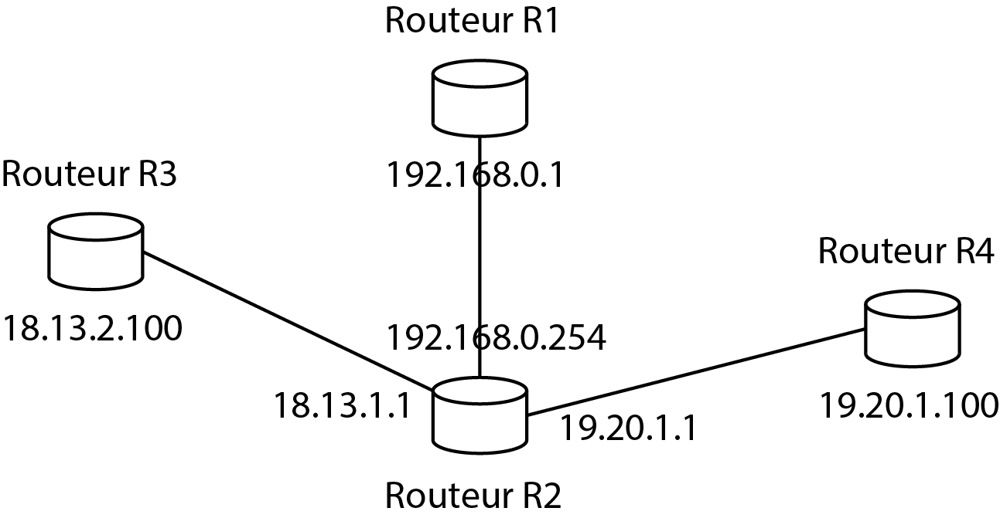
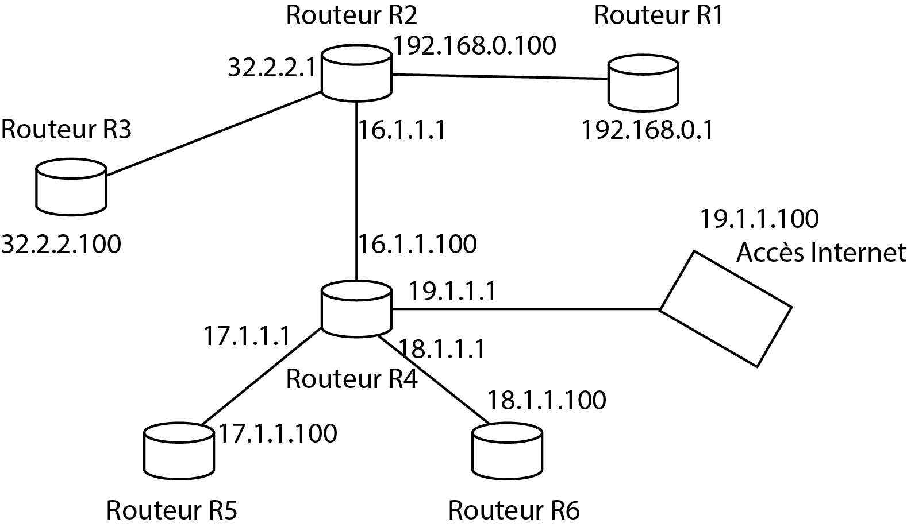

## Exercices Réseaux et sécurité

**Exercice 1** :  

Un routeur a la table de routage suivante :

<table>
<tr>
<td>Adresse de destination</td>
<td>Passerelle</td>
<td>Interface</td>
<td>Vecteur de distance</td>
</tr>
<tr>
<td>192.8.13.20</td>
<td>192.168.1.254</td>
<td>192.168.1.3</td>
<td>3</td>
</tr>
<tr>
<td>192.168.1.0</td>
<td>192.168.1.254</td>
<td>192.168.1.3</td>
<td>1</td>
</tr>
<tr>
<td>180.18.0.0</td>
<td>180.18.1.254</td>
<td>180.18.1.1</td>
<td>1</td>
</tr>
<tr>
<td>180.19.0.0</td>
<td>180.19.1.254</td>
<td>180.18.1.1</td>
<td>2</td>
</tr>
<tr>
<td>180.19.3.0</td>
<td>180.19.1.254</td>
<td>180.18.1.1</td>
<td>2</td>
</tr>
<tr>
<td>Défaut</td>
<td>192.168.1.254</td>
<td>192.168.1.3</td>
<td>1</td>
</tr>
</table>

Donner le message RIP émis par ce routeur.

**Exercice 2** :

Soit le réseau suivant :

Donner la table de routage RIP du routeur R1.

**Exercice 3** :

Soit le réseau suivant :

1. Expliquer comment, lorsqu'il reçoit un datagramme sur l'une de ses interfaces, le routeur R2 rentransmet ce datagramme en fonction de son destinataire.
2. Donner la table de routage RIP du routeur R2.
3. Donner la table de routage RIP du routeur R4.
4. Donner la table de routage RIP du routeur R6.
