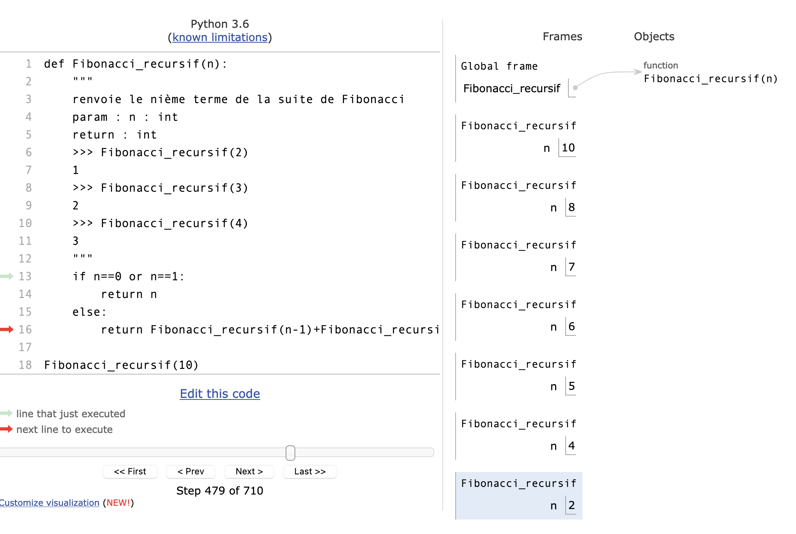
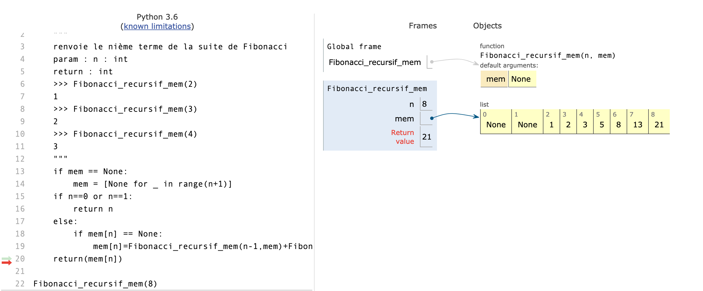
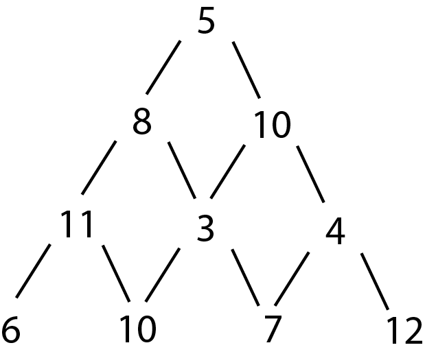

## La programmation dynamique

1. Nécessité de la programmation dynamique

Afin d'expliquer la nécessité de la programmation dynamique, nous commençons par étudier l'exemple simple de la suite de Fibonacci.
Celle-ci consiste à étudier une suite de nombres entiers définie par :
**une phase d'initialisation**
u<sub>0</sub>=0 ; 
u<sub>1</sub>=1 ;
et une **relation de récurrence** : u<sub>n</sub>=u<sub>n-1</sub>+u<sub>n-2</sub>.
On obtient ainsi les premiers termes :
u<sub>2</sub>=u<sub>1</sub>+u<sub>0</sub>=1+0=1. 
u<sub>3</sub>=u<sub>2</sub>+u<sub>1</sub>=1+1=2. 
u<sub>4</sub>=u<sub>3</sub>+u<sub>2</sub>=2+1=3....etc...

La mise en oeuvre du calcul du nième terme de la suite de Fibonacci peut se faire en Python de différentes méthodes.


1ère méthode : **méthode itérative**

```python
def Fibonacci_iteratif(n):
    """
    renvoie le nième terme de la suite de Fibonacci
    param : n : int
    return : int
    >>> Fibonacci_iteratif(2)
    1
    >>> Fibonacci_iteratif(3)
    2
    >>> Fibonacci_iteratif(4)
    3
    """
    u,v=0,1
    for i in range(n-1):
        u,v=v,u+v
    return v
```

2ième méthode : **méthode récursive**

```python
def Fibonacci_recursif(n):
    """
    renvoie le nième terme de la suite de Fibonacci
    param : n : int
    return : int
    >>> Fibonacci_recursif(2)
    1
    >>> Fibonacci_recursif(3)
    2
    >>> Fibonacci_recursif(4)
    3
    """
    if n==0 or n==1:
        return n
    else:
        return Fibonacci_recursif(n-1)+Fibonacci_recursif(n-2)
```

Un tel algorithme met en oeuvre un calcul d'une manière dite **récursive** car la fonction Fibonacci s'appelle elle-même dans sa définition. Toutefois cette façon de procédé présente un problème d'efficacité dans sa mise en oeuvre dès lors que la valeur de n devient importante.

 Pour nous en rendre compte, on se propose de comparer les durées d'exécution des deux procédés en important le module `time` ; la durée est calculée entre l'instant qui suit l'appel et l'instant qui précède l'appel de la fonction.

```python
import time

def calcul_temps_Fibonacci_iteratif(n):
    timestamp1 = time.time()
    val = Fibonacci_iteratif(n)
    timestamp2 = time.time() - timestamp1
    return timestamp2
    
>>> calcul_temps_Fibonacci_iteratif(10)
4.76837158203125e-06
>>> calcul_temps_Fibonacci_iteratif(20)
8.344650268554688e-06
>>> calcul_temps_Fibonacci_iteratif(30)
5.9604644775390625e-06
>>> calcul_temps_Fibonacci_iteratif(40)
5.9604644775390625e-06


def calcul_temps_Fibonacci_recursif(n):
    timestamp1 = time.time()
    val = Fibonacci_recursif(n)
    timestamp2 = time.time() - timestamp1
    return timestamp2

>>> calcul_temps_Fibonacci_recursif(10)
3.504753112792969e-05
>>> calcul_temps_Fibonacci_recursif(20)
0.003946065902709961
>>> calcul_temps_Fibonacci_recursif(30)
0.3979020118713379
>>> calcul_temps_Fibonacci_recursif(40)
48.48135781288147
```

On se rend compte que le temps d'exécution par le procédé récursif "explose" dès que n devient supérieur à 20 par rapport au temps d'exécution par le procédé itératif ; on peut même s'interroger sur l'efficacité du procédé récursif par rapport au procédé itératif au vu des résultats !

Pour mettre en évidence le problème de façon visuelle, on peut utiliser l'application en ligne [pythontutor](http://www.pythontutor.com/)  qui permet de visualiser l'exécution du code. 

 

Par exemple pour le calcul de Fibonacci_recursif(8), on compte pas moins de 265 pas constitués d'allers-retours car le programme ne peut avancer qu'en recalculant de nombreuses fois les mêmes valeurs.

La remédiation est d'enregistrer les résultats au fur et à mesure de leur obtention pour ne pas avoir à les recalculer d'où le nom de programmation dynamique ; ce procédé est appelé procédé de **mémoïsation**.

```python
def Fibonacci_recursif_mem(n,mem=None):
    """
    renvoie le nième terme de la suite de Fibonacci
    param : n : int
    return : int
    >>> Fibonacci_recursif_mem(2)
    1
    >>> Fibonacci_recursif_mem(3)
    2
    >>> Fibonacci_recursif_mem(4)
    3
    """
    if mem == None:
        mem = [None for _ in range(n+1)]
 #on construit une liste constituée de (n+1) None qui va stocker les résultats
    if n==0 or n==1:
        return n
    else:
        if mem[n] == None:#on effectue le calcul car la valeur est à découvrir
            mem[n]=Fibonacci_recursif_mem(n-1,mem)+Fibonacci_recursif_mem(n-2,mem)
#            print(mem)#pour visualiser l'évolution de la liste de stockage
    return(mem[n])
```

Mesurons les durées pour tester l'efficacité.

```python
def calcul_temps_Fibonacci_recursif_mem(n):
    timestamp1 = time.time()
    val = Fibonacci_recursif_mem(n)
    timestamp2 = time.time() - timestamp1
    return timestamp2

>>> calcul_temps_Fibonacci_recursif_mem(10)
1.5735626220703125e-05
>>> calcul_temps_Fibonacci_recursif_mem(20)
2.288818359375e-05
>>> calcul_temps_Fibonacci_recursif_mem(30)
2.9087066650390625e-05
>>> calcul_temps_Fibonacci_recursif_mem(40)
4.00543212890625e-05
```

Avec `print(mem)` on peut afficher l'évolution de la liste de stockage

```python
>>> Fibonacci_recursif_mem(8)
[None, None, 1, None, None, None, None, None, None]
[None, None, 1, 2, None, None, None, None, None]
[None, None, 1, 2, 3, None, None, None, None]
[None, None, 1, 2, 3, 5, None, None, None]
[None, None, 1, 2, 3, 5, 8, None, None]
[None, None, 1, 2, 3, 5, 8, 13, None]
[None, None, 1, 2, 3, 5, 8, 13, 21]
21
```
ou avec pythontutor :

 


2. Exemple n°1 d'application : le rendu de monnaie

Contexte du problème : on suppose que l'on dispose d'un nombre illimité de pièces de 2cts, 5cts, 10cts, 50cts et 1 euro(100 cts). Le problème est le suivant : " comment rendre la monnaie en un minimum de pièces ? ".

Première approche : on peut proposer une résolution dite " gloutonienne " qui consiste à rendre en premier lieu des pièces de plus grande valeur avec toujours la condition que cette pièce de plus grande valeur ait une valeur inférieure à la somme à rendre et cela jusqu'à ce que la somme à rendre soit égale à zéro.

Exemple : supposons que l'on ait 1 € 77 cts à rendre ; le rendu des pièces de manière gloutonne sera le suivant : une pièce de 1 €, 1 pièce de 50 cts, 1 pièce de 10 cts, 1 pièce de 10 cts, 1 pièce de 5 cts, 1 pièce de 2 cts ; soit un total de 6 pièces.

On peut proposer l'implémentation suivante en python : 

```python
def rendu_monnaie_glouton(somme,pieces):
    """
    Renvoie les pièces à rendre selon un algorithme glouton
    param : somme : int
    param : pieces : list
    return : list
    >>> rendu_monnaie(177,[100,50,10,5,2])
    [100, 50, 10, 10, 5, 2]
    """
    rendu=[]
    while somme>0:
        difference=[(valeur-somme) for valeur in pieces]
        piece=max([element for element in difference if element<=0])+somme
        rendu.append(piece)
        somme-=piece
    return rendu
```

L'algorithme glouton propose une solution mais attention, celle-ci n'est pas toujours optimale !
Pour s'en rendre compte, travaillons avec le système impérial qui est l'ancien système monétaire britannique : imperial = [30,24,12,6,3,1]

```python
>>> rendu_monnaie_glouton(48,[30,24,12,6,3,1])
[30, 12, 6]
```
L'algorithme glouton propose un rendu de 3 pièces alors que la solution optimale est évidemment de rendre 2 pièces : [24,24].

Cherchons maintenant à écrire une fonction `nombre_pieces_opt(somme,pieces)` qui donne le nombre optimal de pièces pour effectuer le rendu.

On cherche à exprimer le problème à l'aide d'une relation de récurrence.

Si nombre_pieces_opt(somme,pieces) désigne le nombre de pièces à rendre de façon optimale, on peut dire qu'il s'agit du minimum entre :  

- nombre_pieces_opt(somme,pieces)
- 1+nombre_pieces_opt(somme-pieces[i],pieces) pour tous les indices i parcourant la liste des pieces

D'où l'implémentation en Python :

```python

from math import inf

def nombre_pieces_opt(somme,pieces):
    """
    Renvoie les pièces à rendre selon un algorithme glouton
    param : somme : int
    param : pieces : list
    return : list
    >>> nombre_pieces_opt(11,[2,5,10,50,100])
    4
    """
    if somme==0:
        return 0
    else:
        mini=inf
    for i in range(len(pieces)):
        if pieces[i]<=somme:
            mini=min(1+nombre_pieces_opt(somme-pieces[i],pieces),mini)
    return mini
```

On observe toutefois que la réponse par exemple à `nombre_pieces_opt(177,[100,50,10,5,2])` est très, très longue à venir...

D'où la nécessité d'utiliser la programmation dynamique pour éviter de recalculer un grand nombre de fois la même chose. 

On suit le même modèle que celui utilisé pour `Fibonacci_recursif_mem(n,mem=None)` ; on construit une liste de stockage qui contient au départ autant d'éléments initialisés à 0 qu'il y a de valeurs possibles de somme. La fonction demande si le calcul de `mem[somme]` a déjà été fait :

- si ce n'est pas le cas, on a alors  `mem[somme]==0`,  la fonction calcule sa valeur en utilisant la relation de récurrence vue précédemment
- si c'est le cas la fonction retourne directement la valeur stockée

```python
def nombre_pieces_opt_mem(somme,pieces,mem=None):
    """
    Renvoie les pièces à rendre selon un algorithme glouton
    param : somme : int
    param : pieces : list
    return : list
    >>> nombre_pieces_opt_mem(11,[2,5,10,50,100])
    4
    """
    if mem == None:
        mem = [0 for _ in range(somme+1)] 
    if somme==0:
        return 0
    else:
        mini=inf
    if mem[somme]==0:
        for i in range(len(pieces)):
            if pieces[i]<=somme:
                mini=min(1+nombre_pieces_opt_mem(somme-pieces[i],pieces,mem),mini)
        mem[somme]=mini
    return(mem[somme])
```

On obtient cette fois-ci la réponse attendue quasiment instantanément avec notre exemple de rendu de monnaie dans le système impérial :

```python 
>>> nombre_pieces_opt_mem(48,[30,24,12,6,3,1])
2
```

et pour notre exemple de départ, on voit que la méthode optimale est la méthode glouton, ce qui est en effet le cas pour notre système de monnaie :

```python 
>>> nombre_pieces_opt_mem(177,[100,50,10,5,2])
6
```

3. Exemple n°2 d'application : le problème du sac à dos

Contexte du problème : on imagine que l'on cherche à remplir un sac à dos avec des objets de valeur en maximisant la valeur totale du contenu du sac. Chaque objet ne peut être pris qu'une seule fois et possède un poids particulier. La contrainte est de ne pas dépasser un poids maximal P pour le sac.

Dans le tableau ci-dessous, on suppose que les objets ont été triés initialement par poids croissants.

<table>
<tr>
<td>objet</td><td>o1</td><td>o2</td><td>o3</td><td>o4</td><td>o5</td>
</tr>
<tr>
<td>poids</td><td>1</td><td>2</td><td>5</td><td>6</td><td>7</td>
</tr>
<tr>
<td>valeur</td><td>1</td><td>6</td><td>22</td><td>18</td><td>28</td>
</tr>
</table>

Rappel de l'algorithme glouton : cet algorithme ne donne pas forcèment le résultat optimal mais il a le mérite de proposer une solution ; il consiste à placer d'abord l'objet de plus grande valeur de poids P1 inférieur à P puis à prendre parmi les objets restants celui de plus grande valeur dont le poids est inférieur à P-P1, etc....

On peut donc réaliser une fonction `ks_glouton(lvaleurs, lpoids,P)` capable de nous donner la liste des indices des objets en suivant l'algortithme glouton.  
On peut également définir une fonction `interet_glouton` pour calculer l'intérêt remporté lorqu'on utilise l'algorithme glouton.

```python
def choix_glouton(lpoids,lvaleurs,P):
    """
    : return : renvoie l'indice de l'objet
    * de poids < limite P
    * de plus grande valeur
    * qui n'est pas encore dans le sac
    s'il existe
    sinon renvoyez none
    :CU: 
    - len(lvaleurs) == len(lpoids) 
    - lpoids est triée par ordre croissant
    >>> choix_glouton(lpoids,lvaleurs,15)
    4
    >>> choix_glouton(lpoids,lvaleurs,6)
    2
    """
    valeurs_des_possibles=[]
    for i in range(len(lpoids)):
        if lpoids[i]<=P:
            valeurs_des_possibles.append(lvaleurs[i])
    if len(valeurs_des_possibles)>0:
        return valeurs_des_possibles.index(max(valeurs_des_possibles))
    else:
        return None
            
from copy import deepcopy
import math 

def ks_glouton(lvaleurs, lpoids,P) :
    """
    renvoie un ensemble d'objet (indices dans lvaleurs et lpoids) pour lesquels
    un choix glouton a été effectué    
    :CU: 
    - len(lvaleurs) == len(lpoids) 
    - lpoids est triée par ordre croissant
    >>> ks_glouton(lvaleurs, lpoids,15)
    [4, 2, 1, 0]
    >>> ks_glouton(lvaleurs, lpoids,6)
    [2, 0]
    """
    replique_poids=deepcopy(lpoids)
    res = []  # liste des objets dans le sac
    poids_dispo = P
    while poids_dispo>0:
        choix=choix_glouton(replique_poids,lvaleurs,poids_dispo)
        if not choix in res and not choix==None:
            res.append(choix)
            poids_dispo=poids_dispo-lpoids[choix]
            replique_poids[choix]=math.inf            
    return res
    
def interet_glouton(lvaleurs, lpoids,P) :
    interet=0
    for indice in ks_glouton(lvaleurs,lpoids,P):
        interet+=lvaleurs[indice]
    return interet
    
```

Nous cherchons maintenant à optimiser la solution en utilisant une fonction récursive.

Dans un premier temps, on réalise la fonction `interet_max(i,P,lpoids,lvaleurs)` capable de nous donner l'intérêt maximal en ne considérant que les i premiers objets.

```python
def interet_max(i,P,lpoids,lvaleurs):
    """
    : param i : longueur de la tranche
    : param P : poids maximal autorisé
    : return : l'intérêt maximal en ne prenant que les i premiers objets
    >>> interet_max(5,15,lpoids,lvaleurs)
    57
    >>> interet_max(5,6,lpoids,lvaleurs)
    23
    >>> interet_max(3,15,lpoids,lvaleurs)
    29    
    """
    if i>0:
        if lpoids[i-1]<=P:
            res=max(interet_max(i-1,P-lpoids[i-1],lpoids,lvaleurs)+lvaleurs[i-1],interet_max(i-1,P,lpoids,lvaleurs))
        else:
            res=interet_max(i-1,P,lpoids,lvaleurs)
    else:
        res=0
    return res
```

Cette fonction est écrite en utilisant une **relation de récurrence** reliant l'intérêt maximal dans le cas où on considère i objets avec l'intérêt maximal dans le cas où on considère (i-1) objets. En effet :

**Si** le poids du (i)ième objet est inférieur à P, signifiant qu'il peut être pris,

l'intérêt maximal en tenant compte de ce (i)ième objet est le <u>maximum entre</u> :

- l'intérêt maximal obtenu avec les (i-1)ième objets avec la contrainte de poids (P - poids du (i)ième élément) + la valeur de ce (i)ième objet dans le cas où ce (i)ième objet serait pris. 
- l'intérêt maximal obtenu avec les (i-1)ième objets avec la contrainte de poids P dans le cas où ce (i)ième objet ne serait pas pris. 


**sinon**, l'intérêt maximal en tenant compte de ce (i)ième objet reste identique à l'intérêt maximal en tenant compte des (i-1)ième objets.

En reprenant la méthode utilisée pour Fibonacci pour mémoriser les calculs intermédiaires, on peut proposer une autre version de la fonction précédente pour le calcul de l'intérêt maximal, utilisant la programmation dynamique :

```python
def interet_max_mem(i,P,lpoids,lvaleurs,mem=None):
    """
    : param i : longueur de la tranche
    : param p : poids maximal autorisé
    : return : l'intérêt maximal en ne prenant que des objets d'indice < i
    >>> interet_max_mem(5,15,lpoids,lvaleurs)
    57
    >>> interet_max_mem(3,15,lpoids,lvaleurs)
    29  
    """
    if mem == None:
        mem = [[None for _ in range(0,P)] for _ in range(0,i)]    
    if mem[i-1][P-1] != None:
        res=mem[i-1][P-1]
    else:
        if i>0:
            if lpoids[i-1]<=P:
                res=max(interet_max_mem(i-1,P-lpoids[i-1],lpoids,lvaleurs,mem)+lvaleurs[i-1],interet_max_mem(i-1,P,lpoids,lvaleurs,mem))
            else:
                res=interet_max_mem(i-1,P,lpoids,lvaleurs,mem)
        else:
            res=0
        mem[i-1][P-1]=res
    return res
```

On observe que l'intérêt glouton correspond ici à l'intérêt optimal :

```python
>>> interet_glouton(lvaleurs, lpoids,15)
57
>>> interet_max_mem(5,15,lpoids,lvaleurs)
57
```

3. Exemple n°3 d'application : la pyramide des nombres

Soit la pyramide des nombres ci-dessous :



On part du sommet de la pyramide et on cherche à optimiser le chemin qui atteint la base de la pyramide.

On se donne la table :

table = [ [5], [8, 10 ], [11, 3, 4], [6, 10, 7, 12 ]]


On cherche à écrire une fonction récursive permettant le calcul du gain maximal.

Soit G(l,r) le gain maximum du nombre situé à la l-ème ligne et la r-ème colonne.


On a : `G(l,r)=table[l][r]+max(G(l+1,r),G(l+1,r+1))`

Avec `G(l,r)=table[n-1][r]` si l=n-1


Ce qui peut s'implémenter en Python :

```python
tab = [ [5], [8, 10 ], [11, 3, 4], [6, 10, 7, 12 ]]

def gain_max(t,l,r):
    """Renvoie le gain maximal
    : param tableau : liste
    : return : int
    >>> gain_max(tab,0,0)
    34
    """
    n=len(t)
    if l==n-1:
        return t[l][r]
    else:
        return t[l][r]+max(gain_max(t,l+1,r),gain_max(t,l+1,r+1))    
```
    
En utilisant la programmation dynamique, sur le même schéma que précédemment, en utilisant le procédé de mémoïsation :

```python
def gain_max_mem(t,l,r,mem=None):
    """Renvoie le gain maximal
    : param tableau : liste
    : return : int
    >>> gain_max_mem(tab,0,0)
    34
    """
    n=len(t)
    if mem == None:
        mem = [[0 for _ in range(n)] for _ in range(n)]
    if mem[l][r] !=0:
        res=mem[l][r]
    else:
        if l<n-1:
            res=t[l][r]+max(gain_max_mem(t,l+1,r),gain_max_mem(t,l+1,r+1))
        else:
            res=t[l][r]
        mem[l][r]=res
#        print(mem)
    return res
```

En affichant la liste de stockage avec print(mem), on obtient :

```python
>>> gain_max_mem(tab,0,0)
[[0, 0, 0, 0], [0, 0, 0, 0], [0, 0, 0, 0], [6, 0, 0, 0]]
[[0, 0, 0, 0], [0, 0, 0, 0], [0, 0, 0, 0], [0, 10, 0, 0]]
[[0, 0, 0, 0], [0, 0, 0, 0], [21, 0, 0, 0], [0, 0, 0, 0]]
[[0, 0, 0, 0], [0, 0, 0, 0], [0, 0, 0, 0], [0, 10, 0, 0]]
[[0, 0, 0, 0], [0, 0, 0, 0], [0, 0, 0, 0], [0, 0, 7, 0]]
[[0, 0, 0, 0], [0, 0, 0, 0], [0, 13, 0, 0], [0, 0, 0, 0]]
[[0, 0, 0, 0], [29, 0, 0, 0], [0, 0, 0, 0], [0, 0, 0, 0]]
[[0, 0, 0, 0], [0, 0, 0, 0], [0, 0, 0, 0], [0, 10, 0, 0]]
[[0, 0, 0, 0], [0, 0, 0, 0], [0, 0, 0, 0], [0, 0, 7, 0]]
[[0, 0, 0, 0], [0, 0, 0, 0], [0, 13, 0, 0], [0, 0, 0, 0]]
[[0, 0, 0, 0], [0, 0, 0, 0], [0, 0, 0, 0], [0, 0, 7, 0]]
[[0, 0, 0, 0], [0, 0, 0, 0], [0, 0, 0, 0], [0, 0, 0, 12]]
[[0, 0, 0, 0], [0, 0, 0, 0], [0, 0, 16, 0], [0, 0, 0, 0]]
[[0, 0, 0, 0], [0, 26, 0, 0], [0, 0, 0, 0], [0, 0, 0, 0]]
[[34, 0, 0, 0], [0, 0, 0, 0], [0, 0, 0, 0], [0, 0, 0, 0]]
34
```
À partir de cet affichage, on peut, en localisant les valeurs des maximums et en les ordonnant trouver le chemin qui conduit à la plus grande valeur 34, en l'occurence le chemin [5,8,11,10].

